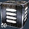

|                          |                                                                                                                                                                                                                                                                                 |
| ------------------------ | ------------------------------------------------------------------------------------------------------------------------------------------------------------------------------------------------------------------------------------------------------------------------------- |
| **Used by**              | [Automatic Machine Pistol](Automatic_Machine_Pistol "wikilink") (AMP), [Repeater](Repeater "wikilink"), [Suppressor](Suppressor "wikilink"), [Cycler](Cycler "wikilink"), [Gauss](Gauss "wikilink"), [Punisher](Punisher "wikilink"), [Mini-Chaingun](Mini-Chaingun "wikilink") |
| **Empire**               | [Common Pool](Common_Pool "wikilink")                                                                                                                                                                                                                                           |
| **Inventory dimensions** | 3x3                                                                                                                                                                                                                                                                             |
| **Quantity per pack**    | 50 bullets                                                                                                                                                                                                                                                                      |

**9mm Bullet**

9mm Bullets are the ubiquitous ordinance of choice for many of the
weapons used by the [New Conglomerate](New_Conglomerate "wikilink") and
[Terran Republic](Terran_Republic "wikilink"). 9mm ammo can be removed
from any equipment terminal by any empire. 9mm ammo is especially
effective against soft or lightly armored targets such as [Infiltration
Suits](Infiltration_Suit "wikilink") as well as
[Standard](Standard_Exo-Suit "wikilink"),
[Agile](Agile_Exo-Suit "wikilink"), and [Reinforced
Exo-suits](Reinforced_Exo-Suit "wikilink"). Standard 9mm Ammo is
ineffective at damaging armored targets. While engaging such targets,
[Armor Piercing 9mm Bullets](AP_9mm_Bullet "wikilink") should be
employed.

Since 9mm Bullets are for use in small arms, they can pass through the
energy shields of [BattleFrame
Robotics](BattleFrame_Robotics "wikilink").

[Category:Game Items](Category:Game_Items "wikilink")
[Category:Ammunition](Category:Ammunition "wikilink")
