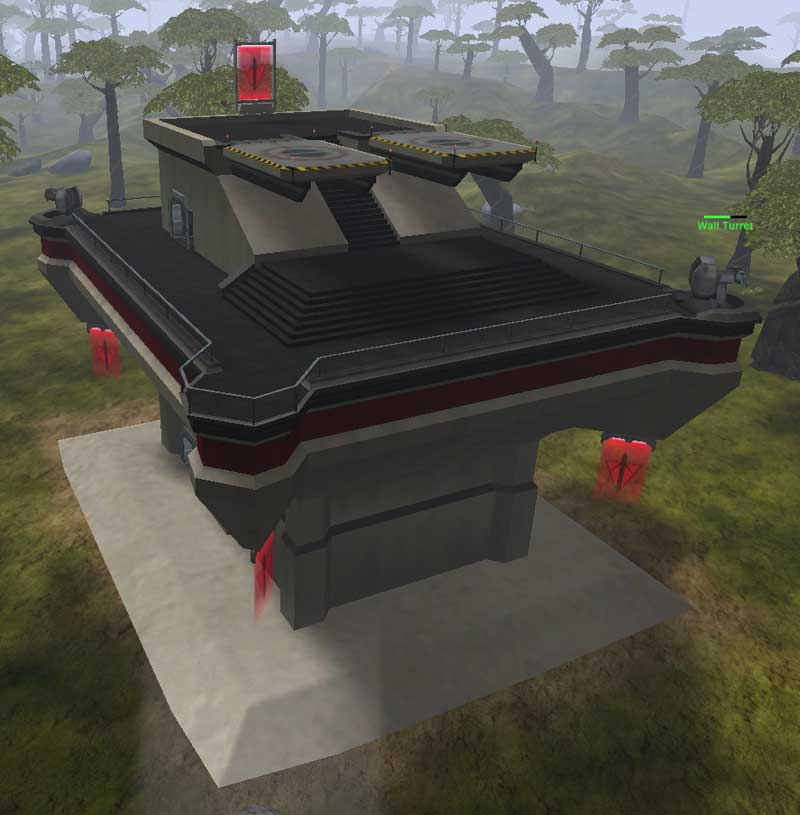

 Air Tower\]\]

In addition to the standard features found in all
[Towers](Towers "wikilink"), the Air Tower is equipped with two
[Phalanx](Phalanx "wikilink") Wall Turrets on the roof walkway, greatly
increasing their tactical value, and providing reasonably robust defence
against infantry or vehicular assault.

The Air Tower is further equipped with two [Landing
Pads](Landing_Pad "wikilink") on the top of the roof, allowing Aircraft
to quickly repair and rearm without having to go back to a Friendly
[Facility](Facility "wikilink"). The Phalanx Wall Turrets and the
repairing/rearming [Air Cavalry](Air_Cavalry "wikilink") units make the
Air Tower that hardest Tower to capture but it is also the most valuable
of the three.

(Note: While a [Facility](Facility "wikilink") expends
[NTU](NTU "wikilink") to auto-repair Wall Turrets, an Air Tower is
considered to have infinite NTU for this purpose, although the rate is
still very slow.)

[Category:Locations](Category:Locations "wikilink")
