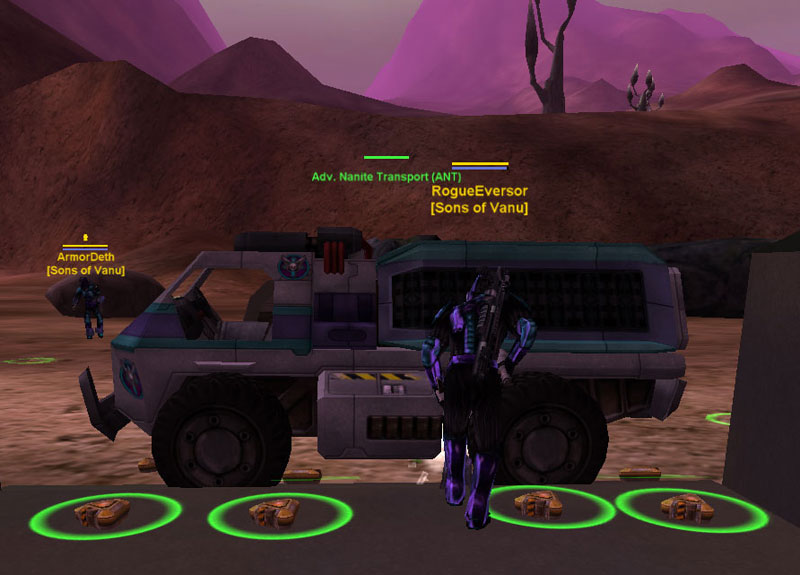
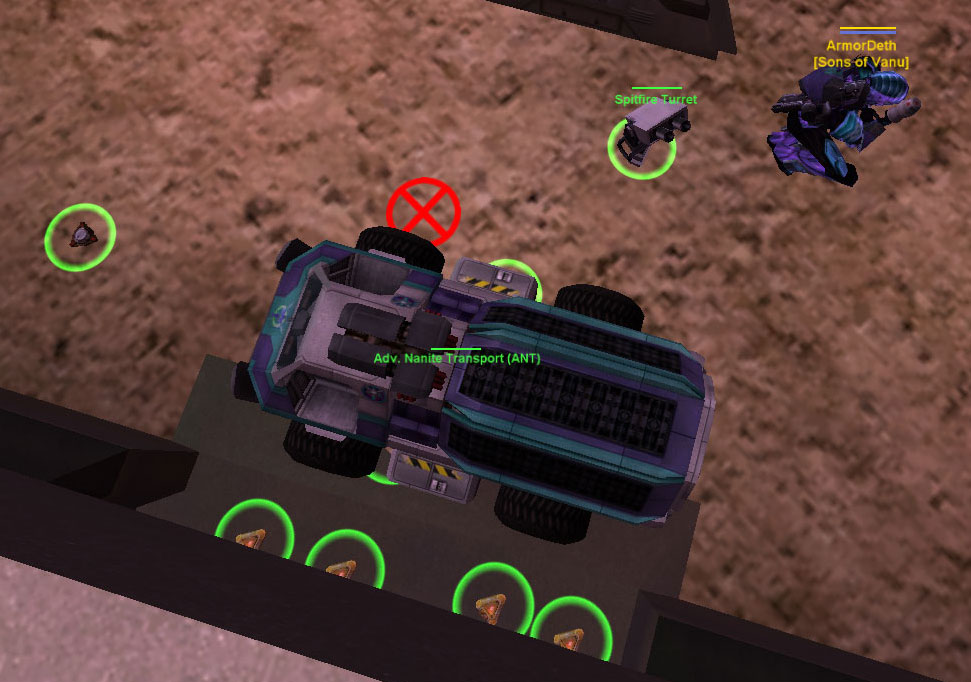

## **The ArmorDeth Ant Trap & The ArmorDeth AMS Trap**

 Trap nears
completion at a [Searhus](Searhus "wikilink") [Back
Door](Back_Door "wikilink")\]\]
 Trap nears completion
at a [Searhus](Searhus "wikilink") [Back Door](Back_Door "wikilink")\]\]
What is it? Well after watching all my
[CE](Combat_Engineering "wikilink") get [EMP](EMP "wikilink")'ed over
and over again. I though, what if an ant was blocking the door and they
emp'ed all my mines and it blew the [ANT](ANT "wikilink") and killed
them all? So I tested it out and guess what? It works!

Every squad has at least one [CR3](Command_Rank "wikilink") or greater,
so most infantry assault squads will EMP an area before moving on the
backdoor. So why do you still put up CE? It slows them down enough for
your squad to react to the drop.

Lets go over the game plan, it's very simple.

### Outside

1.  CE's, mine the area outside of the backdoor, place one mine in front
    of the door. Use all your spits to create a kill zone.

<!-- -->

1.  Get an ANT. Park it at the backdoor, test it by trying to squeeze
    by. If you can't then its setup properly.

<!-- -->

1.  [Boomers](Boomer "wikilink")! Deploy all twenty boomers around the
    ANT and mine field. Store the sticks in your locker or place them in
    a stairwell.

### Inside

1.  CE's, place a [Motion Sensor](Motion_Sensor "wikilink") right on the
    backdoor in the middle. So you open the door, look up and place the
    motion sensor. You can not pass the sensor without crouching under
    it as an Agile (NOTE - Reinforced and MAXES cannot pass). **UPDATE**
    _- Place a spitfire right below the motion sensor, it will take some
    practice, but the door should hide the spit._

<!-- -->

1.  Go to the [gen room](Generator "wikilink") area, we all know the
    fastest way to the gen room right? Well after you breach the
    backdoor and enter the main area, take the right and place a motion
    sensor on the door leading to the basement. Place another motion
    sensor on the main gen room door, center it and try to get by. If
    you can get by any sensors, destroy them and try again.

### So lets recap!

CE the hell out of the backdoor area, place your sensors correctly, park
your ANT, grab your lasher or thumper and have fun!

## UPDATE: The ArmorDeth AMS Trap

What if you changed the ANT to a deployed cloaked [AMS](AMS "wikilink")?
Let me tell you what happens when you do that. Fun! When an enemy drops
they will not see the CE due to the cloaked bubble. Once they land and
fire off an EMP, boom baby! The mines and boomers will go off and
destroy the AMS and we all know how much damage an AMS can do.

Fun Stuff!

---

**ArmorDeth**

**Sons Of Vanu**

"You ain't leadin' but two things right now: Jack and Shit. And Jack
left town."

[category:Strategy](category:Strategy "wikilink")
