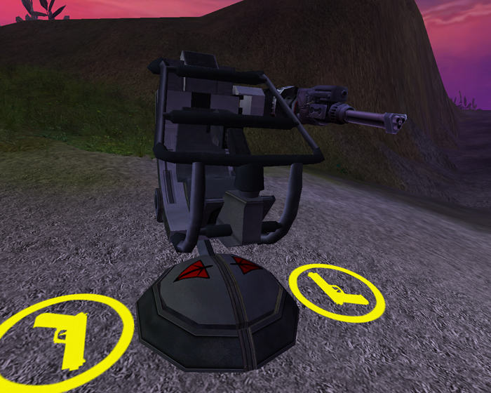
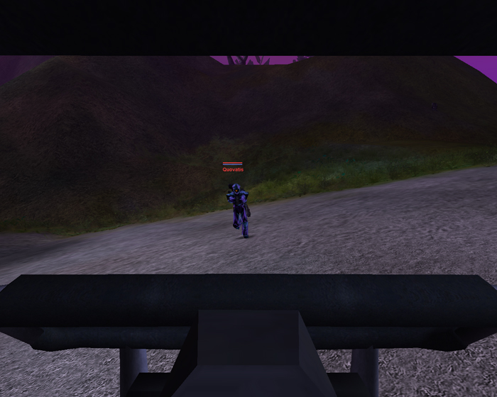

|                            |                                                                                                                  |
| -------------------------- | ---------------------------------------------------------------------------------------------------------------- |
| **Certification Required** | [Assault Engineering](Assault_Engineering "wikilink") or [Advanced Engineering](Advanced_Engineering "wikilink") |
| **Empire**                 | [Terran Republic](Terran_Republic "wikilink")                                                                    |
| **Primary Mode**           | Upgraded Cycler                                                                                                  |
| **Secondary Mode**         | \-                                                                                                               |
| **Ammunition**             | Unlimited                                                                                                        |
| **Inventory Dimensions**   | 3 x 9 (Rifle holster)                                                                                            |
| **Magazine Capacity**      | 200                                                                                                              |
| **Range**                  | 250m                                                                                                             |
| **Zoom**                   | 4x                                                                                                               |

**Avenger**

The [Terran Republic](Terran_Republic "wikilink") Variant of the
[One-Manned Field Turrets](One-Manned_Field_Turret "wikilink"), and is
deployed by use of the [Field Deployment
Unit](Field_Deployment_Unit "wikilink"). It is an adaptation of the
[Dual Cycler](Dual_Cycler "wikilink") [MAX](MAX "wikilink") weapon. The
rate of fire is similar to a locked-down Dual Cycler MAX. It has
unlimited ammunition, though it does have to reload after its clip has
been depleted.

[Category:Weapons](Category:Weapons "wikilink")
