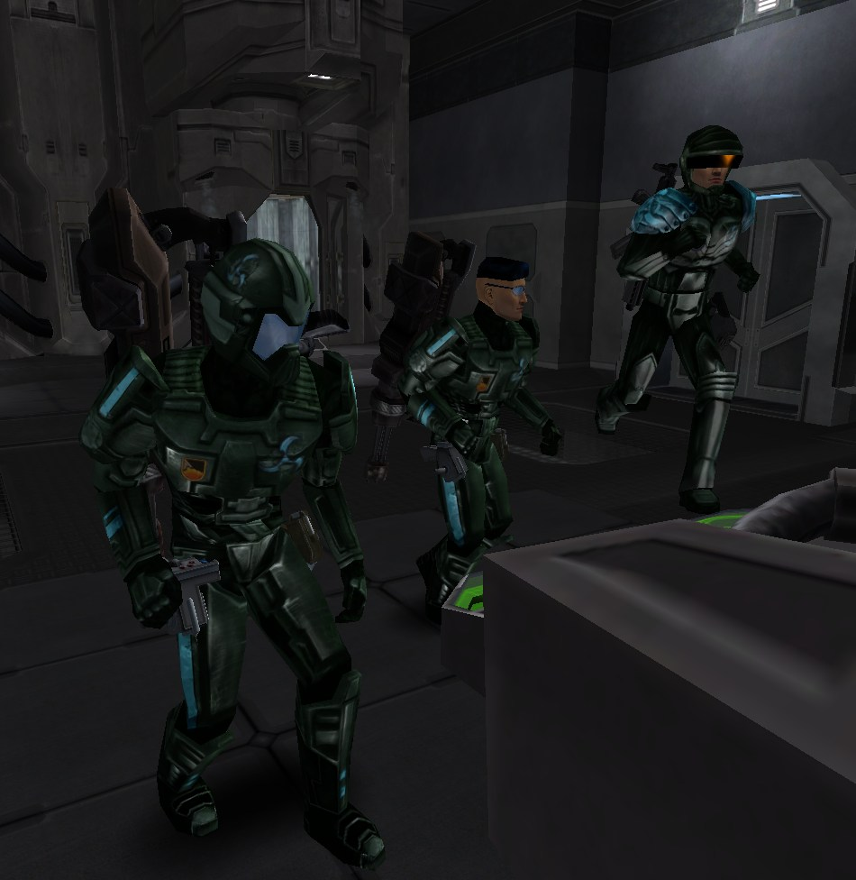
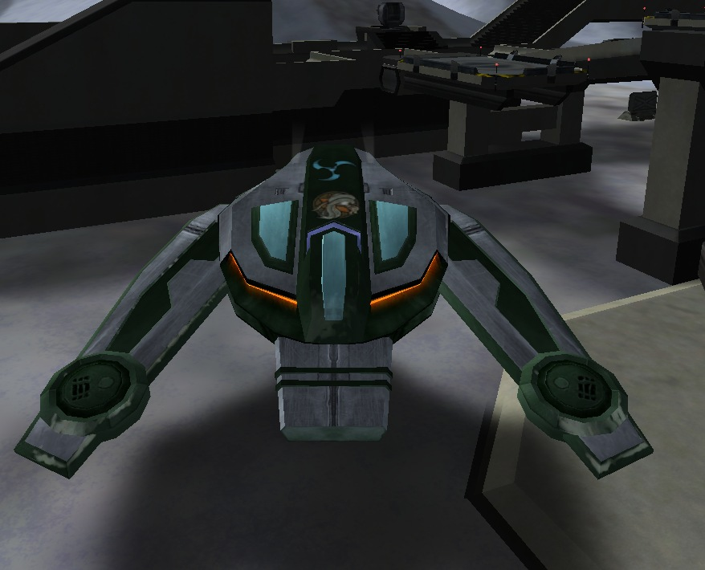

\]\]
\]\]
 that is hacked
by Black Ops, as seen on the [continental
map](Continental_Map "wikilink")\]\]

Black Ops (BO) are the Super Soldiers of
[PlanetSide](PlanetSide "wikilink"). Having 1000
[Health](Health "wikilink") and 500 [Stamina](Stamina "wikilink") (which
has a much higher regeneration rate than normal) and having access to
all [certifications](certification "wikilink"), and therefor all
[vehicles](vehicle "wikilink") and [weaponry](weaponry "wikilink") they
are a force to be reckoned with. Black Ops soldiers can only chose
between [Agile Exo-Suit](Agile_Exo-Suit "wikilink") and [Reinforced
Exo-Suit](Reinforced_Exo-Suit "wikilink") and cannot choose
[MAX](MAX "wikilink") armor. All vehicles are available with greenish
textures to denote Black Ops, though [BFRs](BFR "wikilink") are only
available if enabled by a GM. [One-Manned Field
Turrets](One-Manned_Field_Turret "wikilink") deployed by Black Ops will
be the empire variant of the empire they left.

Black Ops do have certain restrictions/penalties however, as they cannot
use any [Implants](Implant "wikilink") and are not awarded any form of
Experience Points for their activities. Kills made as a Black Ops also
do not count towards [Merit](Merit "wikilink") progress or track on the
[PlanetSide](PlanetSide "wikilink") statistic websites.

Black Ops can only
[Squad](Squad "wikilink")/[Platoon](Platoon "wikilink") together with
other Black Ops, and cannot use any [chat](chat "wikilink") except for
the special Black Ops chat (/b <message> or /c <message> when playing as
a Black Ops) and Squad/Platoon Chat.

Black Ops can only be on the continent(s) enabled by the GM (usually
only one), as all others will be locked to them. By using the Black Ops
HQ they can instantly [HART](HART "wikilink") drop anywhere on the
[continent](continent "wikilink"), as well as spawn at any neutral
[Facility](Facility "wikilink") or [Tower](Tower "wikilink") on that
continent. In addition, they can spawn at
[AMSes](Advanced_Mobile_Station "wikilink") that are placed by other
Black Ops.

Towers will go neutral the moment they are hacked by a Black Ops,
Facilities have a 5 minute timer before they flip. Black Ops can only
own or have a hack on a maximum of 3 bases, but there is no limit on the
number of towers they can own.

Note that even though all cosmetic [Command
Rank](Command_Rank "wikilink") attributes like the CR5
[backpack](backpack "wikilink") disappear when being turned into a Black
Ops, they will still keep the Command abilities ([Orbital
Strike](Orbital_Strike "wikilink"), [EMP](EMP "wikilink"), Reveal
Enemies and Reveal Friendliess) they have as a normal soldier.

When transformed into a Black Ops, the player will receive the [Black
Ops Mercenary](Black_Ops_Mercenary "wikilink") Merit Commendation.

[VS](Vanu_Sovereignty "wikilink"), [TR](Terran_Republic "wikilink") and
[NC](New_Conglomerate "wikilink") Soldiers that kill a Black Ops will be
awarded with the [Black Ops Hunter](Black_Ops_Hunter "wikilink") Merit
Commendations.

[Category:Terminology](Category:Terminology "wikilink")
