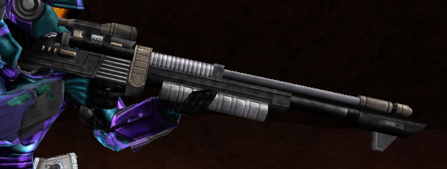

 [Rexo](Rexo "wikilink")
wields a Bolt Driver in [Byblos](Byblos "wikilink")\]\]

|                            |                                       |
| -------------------------- | ------------------------------------- |
| **Certification Required** | [Sniping](Sniping "wikilink")         |
| **Empire**                 | [Common Pool](Common_Pool "wikilink") |
| **Primary Mode**           | Single Shot                           |
| **Secondary Mode**         | \-                                    |
| **Ammunition**             | [Bolt](Bolt "wikilink")               |
| **Range**                  | Visual rendering distance             |
| **Inventory Dimensions**   | 3 x 9 (Rifle Holster)                 |
| **Magazine Capacity**      | 1                                     |
| **Zoom**                   | 8x                                    |

**Bolt Driver**

The Bolt Driver is one of the two sniper rifles in the game. Unless
crouched, the initial [cone of fire](cone_of_fire "wikilink") is very
large, blooming out to nearly the entire screen after a shot or moving
even slightly. As such, it is only useful if you can be crouched and
stationary and can anticipate your target's location.

The Bolt Driver can "one-shot kill" infantry without armor protection,
such as [Cloakers](Infiltrator "wikilink") or soldiers whose armor has
been damaged severely, or characters who aren't at full health.
Characters with armor, however, aren't completely safe, as a successful
hit will reduce health by more than half and remove a significant amount
of armor. Enough so that a second shot will net the kill. (75 points of
health per shot vs [Agile Exo-Suit](Agile_Exo-Suit "wikilink"), and 65
points vs [Reinforced Exo-Suit](Reinforced_Exo-Suit "wikilink"))

It is little more than a nuisance to
[MAX's](Mechanized_Armored_Exo-Suit "wikilink"), causing 50 points of
damage to their armor (or health when the
[MAX](Mechanized_Armored_Exo-Suit "wikilink")'s armor has been drained),
and likely not even noticed by [vehicles](Vehicle_Index "wikilink") and
[Phalanx](Phalanx "wikilink") turrets (unless extremely damaged). The
large caliber bolt can, however, pass through [BattleFrame
Robotics](BattleFrame_Robotics "wikilink")' shields and can do
significant damage to internal systems. The Bolt Driver's shot will
damage different systems depending on where it is aimed. Aiming for the
weapons creates a chance of damaging the BattleFrame Robotics' weapons,
the Torso creates a chance of destroying an item in the BattleFrame
Robotics' trunk, aiming for the BattleFrame Robotics' legs has a chance
of damaging the motion servos, slowing the [BattleFrame
Robotics](BattleFrame_Robotics "wikilink"). Finally the Shield Generater
can be damaged by a single Bolt Driver shot, or disabled by three in
quick succesion.

[Category:Game Items](Category:Game_Items "wikilink")
[Category:Weapons](Category:Weapons "wikilink") [Category:Common Pool
Weapons](Category:Common_Pool_Weapons "wikilink")
