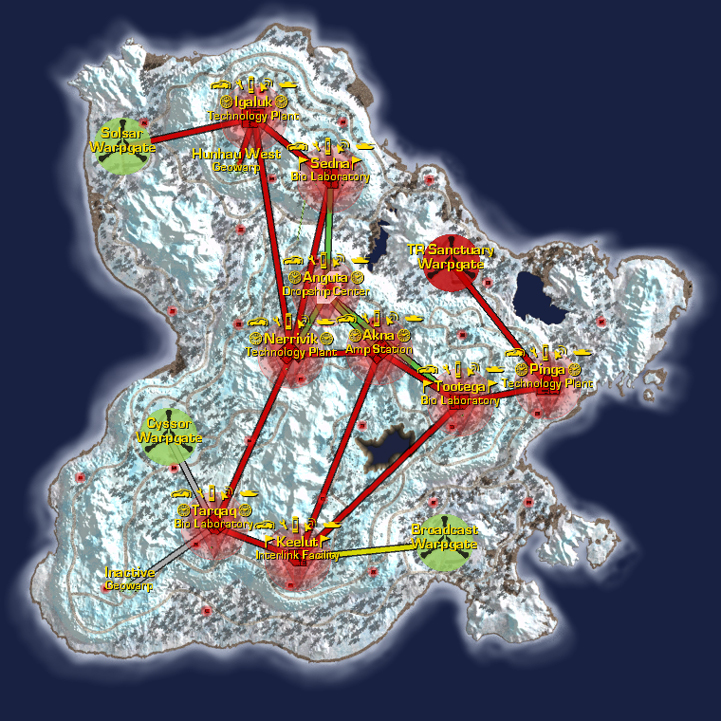
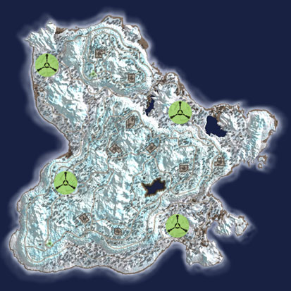

## Continental Data

|                   |                                                                           |
| ----------------- | ------------------------------------------------------------------------- |
| Category:         | Binary Temperate                                                          |
| Climate:          | Arctic                                                                    |
| Landmass:         | Continent                                                                 |
| Terrain:          | Icy cliffs, frozen plains, treacherous roads, snow-covered canyons        |
| Facilities:       | 10                                                                        |
| Towers:           | 27                                                                        |
| Active Warpgates: | 4                                                                         |
| Capitol:          | [Dropship Center](Dropship_Center "wikilink") [Anguta](Anguta "wikilink") |

## Description

A distant yellow sun does little to warm this permafrost planet.

Extremely tall cliffs create chasms and blocks that challenge the
tactical mind of any Commander. Cliffs abound and a misplaced footstep
can send you hurtling to your doom. Air vehicles can cross terrain
quickly, but foot soldiers and ground vehicles find that many miles lay
between point A and point B due to successive switchbacks and roundabout
roads crawling up the vertical cliffsides.

The central plateau that houses the capitol,
[Anguta](Anguta "wikilink"), and two of its sub-capitols rises high
above the rest of the continent.

Ceryshen is a [Home Continent](Home_Continent "wikilink"). See [Home
Continent](Home_Continent "wikilink") for the current empire
[Sanctuary](Sanctuary "wikilink") links.

This continent is also refered to as
[Cery](Acronyms_and_Slang "wikilink").

---

--source: Planetside In-game descriptions, pre- and post-Bending.

## Base Facilities

### Amp Stations

- [Akna](Akna "wikilink") ([Sub-Capitol](Sub-Capitol "wikilink"))

### Bio Laboratories

- [Sedna](Sedna "wikilink") (Sub-Capitol)
- [Tootega](Tootega "wikilink") (Sub-Capitol)
- [Tarqaq](Tarqaq "wikilink")

### Dropship Centers

- [Anguta](Anguta "wikilink") ([Capitol](Capitol "wikilink"))

### Interlink Facilities

- [Keelut](Keelut "wikilink")

### Technology Plants

- [Igaluk](Igaluk "wikilink")
- [Nerrivik](Nerrivik "wikilink") (Sub-Capitol)
- [Pinga](Pinga "wikilink")

[Category:Locations](Category:Locations "wikilink")
