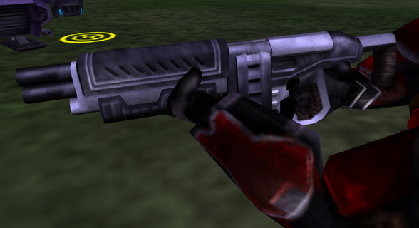

|                            |                                                                                               |
| -------------------------- | --------------------------------------------------------------------------------------------- |
| **Certification Required** | [Medium Assault](Medium_Assault "wikilink")                                                   |
| **Empire**                 | [Terran Republic](Terran_Republic "wikilink")                                                 |
| **Primary Mode**           | Rapid Fire                                                                                    |
| **Secondary Mode**         | \-                                                                                            |
| **Ammunition**             | 9mm Bullets ([Standard](9mm_Bullet "wikilink") or [Armor Piercing](AP_9mm_Bullet "wikilink")) |
| **Range**                  | 200m                                                                                          |
| **Inventory Dimensions**   | 3 x 6 (Rifle Holster)                                                                         |
| **Magazine Capacity**      | 50                                                                                            |
| **Zoom**                   | 4x                                                                                            |

**Cycler**

The Cycler is the [Medium Assault](Medium_Assault "wikilink") rifle of
the [Terran Republic](Terran_Republic "wikilink"). Following its
empire's motif, it boasts the largest magazine capacity and highest fire
rate of the medium assault rifles.

Like all medium assault rifles, it exhibits a cone of fire bloom when
fired in long bursts; better accuracy comes with shorter bursts.

Shots to kill:

|                                                       |                                          |
| ----------------------------------------------------- | ---------------------------------------- |
| [Standard Exo-Suit](Standard_Exo-Suit "wikilink")     | 8 shots                                  |
| [Agile Exo-Suit](Agile_Exo-Suit "wikilink")           | 9 shots                                  |
| [Reinforced Exo-Suit](Reinforced_Exo-Suit "wikilink") | 13 shots                                 |
| [MAX](MAX "wikilink")                                 | 58 [AP](Armor_Piercing "wikilink") shots |

(The above numbers are taken with 100 Health and full Armor; no
[MedKits](MedKit "wikilink"), [Implants](Implants "wikilink") or [Empire
Incentives](Empire_Incentives "wikilink") applied)

[Category:Game Items](Category:Game_Items "wikilink")
[Category:Weapons](Category:Weapons "wikilink") [Category:Terran
Republic Weapons](Category:Terran_Republic_Weapons "wikilink")
