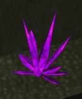

\]\]

Damage Crystals, are very rare [Crystals](Crystal "wikilink") and can be
identified by its purple color and pointed tips. They're not useful
though. When you are in their proximity, they do damage to your Health,
rather similar to the Pain Fields found in [Spawn
Rooms](Spawn_Room "wikilink").

If you want to find one, there are at least 2 in
[Hunhau](Hunhau "wikilink"). One is located in the North-central area of
grid F-10 by a ramp and can be walked away from. Another one is located
in the top left corner of cell J-14 in a hole by a ramp. Note that
unless you are a [VS](VS "wikilink") [MAX](MAX "wikilink") you will die
since there is no way out of the hole. Another one, located in
[Adlivun](Adlivun "wikilink") cavern, is located at the upper, center of
grid H-15. Just before you get on the UP [zipline](zipline "wikilink"),
look down to your left, into the crevice for it.

[Category:Game Items](Category:Game_Items "wikilink")
