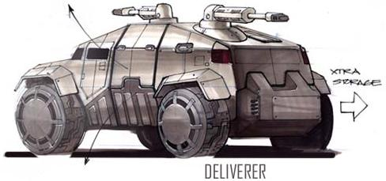
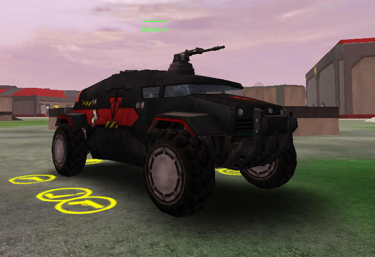

 Deliverer\]\]

|                            |                                                                   |
| -------------------------- | ----------------------------------------------------------------- |
| **Type**                   | Medium Transport                                                  |
| **Role**                   | Medium Troop Transport                                            |
| **Certification Required** | [Ground Transport](Ground_Transport "wikilink")                   |
| **Empire**                 | [Common Pool](Common_Pool "wikilink")                             |
| **Primary Weapon**         | 2 20mm Recoilless Cannons                                         |
| **Secondary Weapon**       | \-                                                                |
| **Ammunition Used**        | [Recoilless Cannon Bullets](Recoilless_Cannon_Bullets "wikilink") |
| **Occupants**              | 5 (Driver, 2 Gunners and 2 Passengers)                            |
| **Handling**               | Good                                                              |
| **Top speed**              | 68 kph (43 kph over water)                                        |

**Deliverer**

While less maneuverable than assault buggies, the Deliverer has two
gunners -- one next to the driver, facing forward, the other in the
rear, covering the back. A reasonable trunk provides adequate space to
carry supplies as well. The Deliverer also has the distinct advantage of
being able to cross calm rivers and waterways and will float at the
surface.

[category:Game Items](category:Game_Items "wikilink")

[Category:Vehicles](Category:Vehicles "wikilink") [Category:Common Pool
Vehicles](Category:Common_Pool_Vehicles "wikilink")
