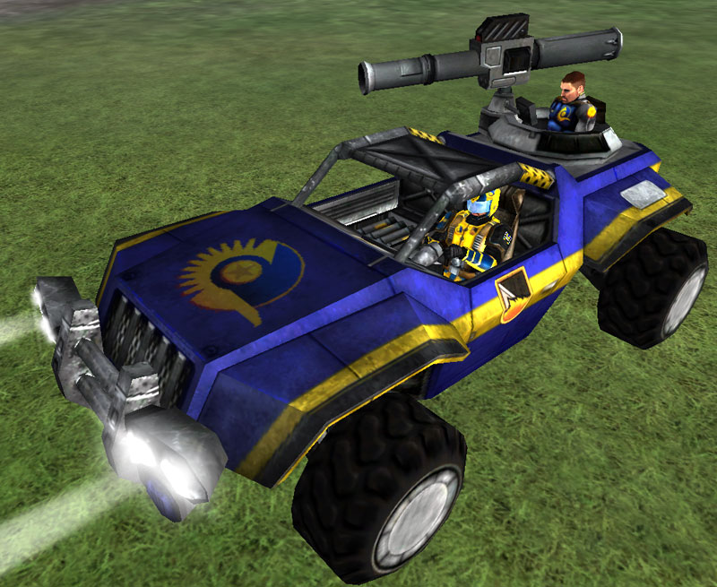

 Enforcer\]\]

|                            |                                                                                                      |
| -------------------------- | ---------------------------------------------------------------------------------------------------- |
| **Type**                   | Heavy Assault Buggy                                                                                  |
| **Role**                   | Attack/Defense                                                                                       |
| **Certification Required** | [Assault Buggy](<Assault_Buggy_(Certification)> "wikilink") or [Light Scout](Light_Scout "wikilink") |
| **Empire**                 | [New Conglomerate](New_Conglomerate "wikilink")                                                      |
| **Primary Weapon**         | [Firebird](Firebird "wikilink") Rocket Launcher                                                      |
| **Ammunition**             | [Firebird Rocket](Firebird_Rocket "wikilink")                                                        |
| **Occupants**              | 2 (Driver and Gunner)                                                                                |
| **Handling**               | Good                                                                                                 |
| **Top speed**              | 80 kph                                                                                               |

**Enforcer**

The [New Conglomerate](New_Conglomerate "wikilink") **Enforcer** buggy
is obtained with the 3 point [Assault
Buggy](<Assault_Buggy_(Certification)> "wikilink")
[Certification](Certification "wikilink") or the 5 point [Light
Scout](Light_Scout "wikilink") certification.

This vehicle requires one driver and one gunner to operate its
[Firebird](Firebird "wikilink") rocket system. The Firebird rocket does
significant damage to vehicles and infantry alike, and is a
direct-firing projectile.

The open cockpit of this vehicle allows the driver to wear [Reinforced
Exo-Suit](Reinforced_Exo-Suit "wikilink") or less.

[Category:Game Items](Category:Game_Items "wikilink")
[Category:Vehicles](Category:Vehicles "wikilink") [Category:New
Conglomerate Vehicles](Category:New_Conglomerate_Vehicles "wikilink")
[Category:Ground Vehicles](Category:Ground_Vehicles "wikilink")
