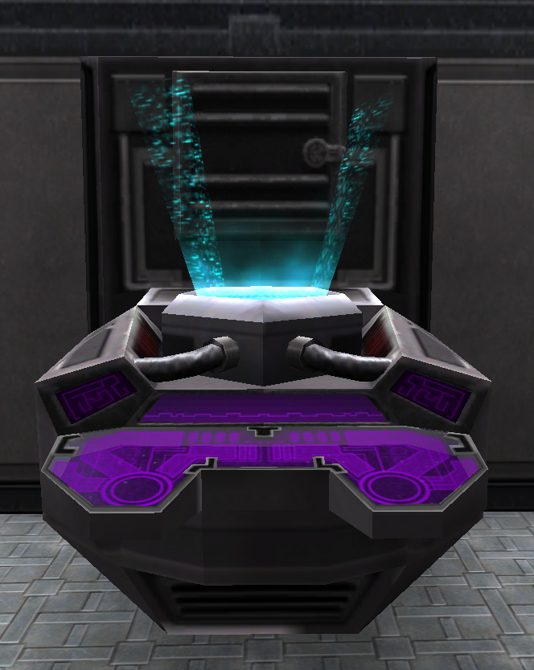

**Equipment terminals** provide troops with
[weapons](Weapons_Index "wikilink"), ammunition,
[armor](Armor_Index "wikilink"), support equipment, and vehicle
ordnance. [Ancient-Tech](Ancient-Tech "wikilink") weaponry can also be
acquired if an [Equipment Module](Equipment_Module "wikilink") is
installed or a [Cavern Lock](Cavern_Lock "wikilink") is linked through
the [lattice](lattice "wikilink").

These terminals are crucial to any war effort and can be found in
numerous places. Each [Advanced Mobile
Station](Advanced_Mobile_Station "wikilink"), or AMS, supplies two on
either side of the vehicle. The [Respawn
Building](Respawn_Building "wikilink"), [VR
Training](VR_Training "wikilink") Rooms, [HART
building](HART_building "wikilink"), and [towers](towers "wikilink") in
each Empire's [Sanctuary](Sanctuary "wikilink") contain two or more
equipment terminals.

All base [facilities](facilities "wikilink") provide equipment terminals
in the [Respawn rooms](Respawn_room "wikilink") and the [main
lobby](main_lobby "wikilink"). [Interlink
Facilities](Interlink_Facility "wikilink") and [Dropship
Centers](Dropship_Center "wikilink") contain extra teriminals on the top
level in the alcove beneath the radar dish.

Every [tower](towers "wikilink") also contains equipment terminals in
their Respawn rooms.

To access an Equipment terminal, approach and press the use (default
"G") key. This will open up the acquisition window for the terminal, as
well as your [Inventory](Inventory "wikilink") window. You may
double-click on an item or click and drag that item into your inventory.

From the acquisition window you can also save up to 10 unique
[loadouts](loadout "wikilink") of arms and equipment under the
[Favorites](Favorites "wikilink") tab. This allows you to quickly arm
and supply yourself for various situations after respawning.

Equipment terminals can be destroyed, and must be repaired to 50% of
their health before they can be used again with a [Nano
Dispenser](Nano_Dispenser "wikilink").

The Cavern [Facilities](Facilities "wikilink") possess
[Ancient-Tech](Ancient-Tech "wikilink") versions called [Ancient
Equipment Terminals](Ancient_Equipment_Terminal "wikilink"). They
provide the same equipment as their surface counterparts, including
Ancient Tech weaponry. Ancient Equipment Terminals cannot be destroyed
unlike the surface Equipment Terminals. See [Core
Combat](Core_Combat "wikilink").

There is a [known issue](Known_Issues "wikilink") regarding hacked
equipment terminals not functioning properly.

[Category:Game Items](Category:Game_Items "wikilink")
