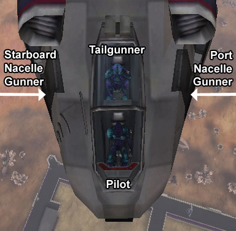

` Galaxy]]`

|                            |                                                                                                                            |
| -------------------------- | -------------------------------------------------------------------------------------------------------------------------- |
| **Type**                   | Dropship                                                                                                                   |
| **Role**                   | Heavy Troop Transport                                                                                                      |
| **Certification Required** | [Air Support](Air_Support "wikilink")                                                                                      |
| **Empire**                 | [Common Pool](Common_Pool "wikilink")                                                                                      |
| **Primary Weapon**         | 2 20mm Recoilless Cannons, 1 20mm Rotary Chaingun                                                                          |
| **Secondary Weapon**       | \-                                                                                                                         |
| **Ammunition Used**        | [Recoilless Cannon Bullets](Recoilless_Cannon_Bullets "wikilink")                                                          |
| **Occupants**              | 12-15 (Pilot, 3 Gunners, 6 Passengers, 2 [MAX](MAX "wikilink") Units, plus a [vehicle](vehicle "wikilink") and passengers) |
| **Handling**               | Very poor                                                                                                                  |
| **Top speed**              | 84 kph (152 with [Afterburners](Afterburner "wikilink"))                                                                   |

**Galaxy**

The **Galaxy** is a huge aircraft capable of carrying 9 infantry and 2
[MAX](MAX "wikilink") units, as well as the pilot and any passengers of
vehicles in its cargo hold. A full squad can be transported easily,
leaving the driver and gunners to return for other passengers.

As pictured to the right, the Pilot sits in the nose of the aircraft,
the forward seat of the canopied cockpit. The tailgun operator mounts
via the ladder on the starboard fuselage, sitting behind him or her,
operating the aft rotary cannon remotely. The port and starboard nacelle
guns are operated in a similar manner by crewmembers sitting on the
appropriate sides of the tailgunner, accessible via doors in the
fuselage.

The [Galaxy](Galaxy "wikilink") can only be purchased at a [Dropship
Center](Dropship_Center "wikilink") or in the
[Sanctuary](Sanctuary "wikilink") and requires the [Air
Support](Air_Support "wikilink")
[certification](certifications "wikilink").

Vehicles that can fit in the [Galaxy](Galaxy "wikilink") cargo hold are:

- [ANT](Advanced_Nanite_Transport "wikilink")
- [Basilisk](Basilisk "wikilink")
- [Enforcer](Enforcer "wikilink")
- [Fury](Fury "wikilink")
- [Harasser](Harasser "wikilink")
- [Lightning](Lightning "wikilink")
- [Marauder](Marauder "wikilink")
- [Skyguard](Skyguard "wikilink")
- [Switchblade](Switchblade "wikilink")
- [Thresher](Thresher "wikilink")
- [Wraith](Wraith "wikilink")

The Galaxy's apparent namesake is the [Lockheed
Galaxy](http://en.wikipedia.org/wiki/C-5_Galaxy)

[Category:Game Items](Category:Game_Items "wikilink")
[Category:Vehicles](Category:Vehicles "wikilink") [Category:Common Pool
Vehicles](Category:Common_Pool_Vehicles "wikilink") [Category:Air
Vehicles](Category:Air_Vehicles "wikilink")
