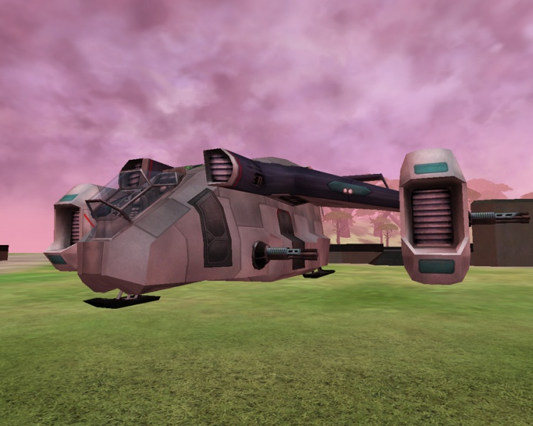
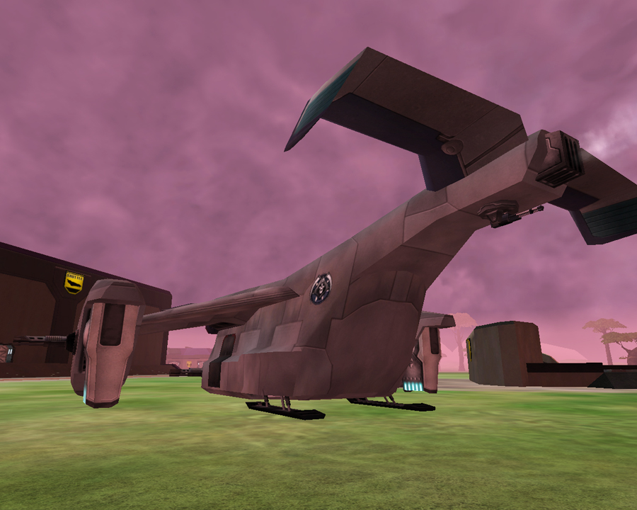

 Galaxy Gunship\]\]

|                            |                                                                                                                |
| -------------------------- | -------------------------------------------------------------------------------------------------------------- |
| **Type**                   | Heavy Gunship                                                                                                  |
| **Role**                   | Attack                                                                                                         |
| **Certification Required** | [Galaxy Gunship](<Galaxy_Gunship_(Certification)> "wikilink")                                                  |
| **Empire**                 | [Common Pool](Common_Pool "wikilink")                                                                          |
| **Primary Weapon**         | Three 35mm Chainguns                                                                                           |
| **Secondary Weapon**       | Two [Ground Pounder](Ground_Pounder "wikilink") Mortar Launchers                                               |
| **Ammunition Used**        | [35mm Chaingun Bullets](35mm_Chaingun_Bullets "wikilink") and [Mortar Cartridges](Mortar_Cartridge "wikilink") |
| **Occupants**              | 6 (1 Pilot, 5 Gunners)                                                                                         |
| **Handling**               | Unknown                                                                                                        |
| **Top speed**              | 85 KPH                                                                                                         |

**Galaxy Gunship**

The Galaxy Gunship is a modified [Galaxy](Galaxy "wikilink") airframe
with heavy guns, and more armor. The gunship takes only 75% of all
damage incident on it, making its effective armor much stronger than the
regular Galaxy without increasing repair time much.

The gunship sports three 35mm chainguns and 2 [Ground
Pounders](Ground_Pounder "wikilink"). It lacks the [MAX](MAX "wikilink")
passenger slots and cargo bay of the original Galaxy. The Galaxy Gunship
is a beast on the battlefield, able to take on almost any single target
at close to medium range. A single anti-aircraft platform is no match
for the gunship.

The Galaxy Gunship can only be purchased at a [Dropship
Center](Dropship_Center "wikilink") or the
[Sanctuary](Sanctuary "wikilink"). The purchase timer is 10 minutes.

[Category:Vehicles](Category:Vehicles "wikilink") [Category:Common Pool
Vehicles](Category:Common_Pool_Vehicles "wikilink") [Category:Air
Vehicles](Category:Air_Vehicles "wikilink") [Category:Game
Items](Category:Game_Items "wikilink")
