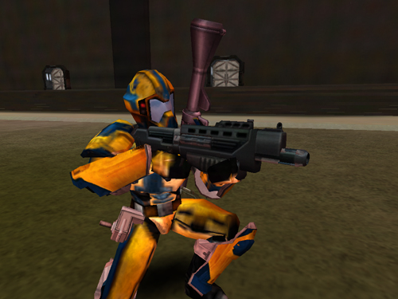

 Soldier holding a
Gauss Rifle\]\]

|                            |                                                                                               |
| -------------------------- | --------------------------------------------------------------------------------------------- |
| **Certification Required** | [Medium Assault](Medium_Assault "wikilink")                                                   |
| **Empire**                 | [New Conglomerate](New_Conglomerate "wikilink")                                               |
| **Primary Mode**           | Single Shot                                                                                   |
| **Secondary Mode**         | \-                                                                                            |
| **Ammunition**             | 9mm Bullets ([Standard](9mm_Bullet "wikilink") or [Armor Piercing](AP_9mm_Bullet "wikilink")) |
| **Range**                  | 200m                                                                                          |
| **Inventory Dimensions**   | 3 x 6 (Rifle Holster)                                                                         |
| **Magazine Capacity**      | 30                                                                                            |
| **Zoom**                   | 4x                                                                                            |

**Gauss**

The [Gauss](Gauss "wikilink") is the [Medium
Assault](Medium_Assault "wikilink") rifle of the [New
Conglomerate](New_Conglomerate "wikilink"). Although it has a smaller
clip and slower rate of fire than the other empire-specific rifles, the
[Gauss](Gauss "wikilink") deals the most damage per shot at most ranges.

Like all [Medium Assault](Medium_Assault "wikilink") rifles, it suffers
from some cone of fire bloom when fired in full-auto; as such, it is
best burst-fired when used at medium to long ranges.

Shots to kill:

|                                                       |                                          |
| ----------------------------------------------------- | ---------------------------------------- |
| [Standard Exo-Suit](Standard_Exo-Suit "wikilink")     | 7 shots                                  |
| [Agile Exo-Suit](Agile_Exo-Suit "wikilink")           | 8 shots                                  |
| [Reinforced Exo-Suit](Reinforced_Exo-Suit "wikilink") | 10 shots                                 |
| [MAX](MAX "wikilink")                                 | 50 [AP](Armor_Piercing "wikilink") shots |

(The above numbers are taken with 100 Health and full Armor; no
[MedKits](MedKit "wikilink"), [Implants](Implants "wikilink") or [Empire
Incentives](Empire_Incentives "wikilink") applied)

[Category:Game Items](Category:Game_Items "wikilink")
[Category:Weapons](Category:Weapons "wikilink") [Category:New
Conglomerate Weapons](Category:New_Conglomerate_Weapons "wikilink")
