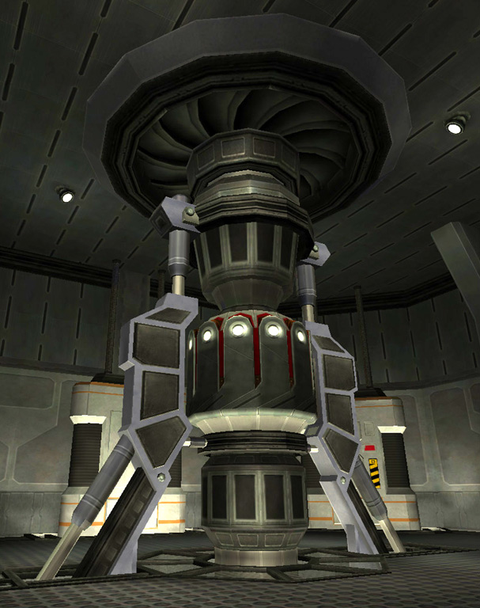
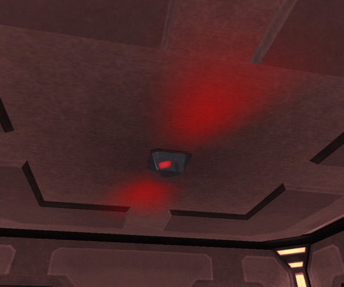

\]\]
 Warning Light: Generator
Destroyed\]\]

The **generator** converts the [NTUs](NTU "wikilink") of a base into
usable energy to fuel base systems and terminals, as well as the
self-repair mechanisms of the base.

Taking this generator offline results in the terminals and systems of
the base being taken offline, including the spawn tubes. The only
exception is the [Control Console](Control_Console "wikilink"), which
runs on its own power supply. It also disables any [Facility Linked
Benefits](Facility_Linked_Benefit "wikilink") the base may be providing.
As well, the facility becomes a dead link in the Lattice system,
blocking benefits from bases behind it on the lattice. Additonally, it
releases the [modules](modules "wikilink") that may be installed in that
facility. This means they can be removed or stolen from their
[cradles](Module_Cradle "wikilink"). A destroyed generator will repair
itself, albeit very slowly, as long as the base has a supply of NTUs
remaining.

Because the generator is such an important part of facility defense, and
even continental defense, a warning is issued throughout the entire
Sphere of Influence ([SOI](SOI "wikilink")) if it comes under attack.

The generator room is also one of the areas protected by a [Pain
Field](Pain_Field "wikilink") when a [Pain
Module](Pain_Module "wikilink") is installed at the base, as a [Lattice
Benefit](Facility_Linked_Benefit "wikilink"), or from a [Cavern
Lock](Cavern_Lock "wikilink") Benefit. An [Expert
Hacker](Expert_Hacking "wikilink") can also hack into the [Generator
Terminal](Generator_Terminal "wikilink") to create or increase a pain
field in the generator room.

[Category:Game Items](Category:Game_Items "wikilink")
