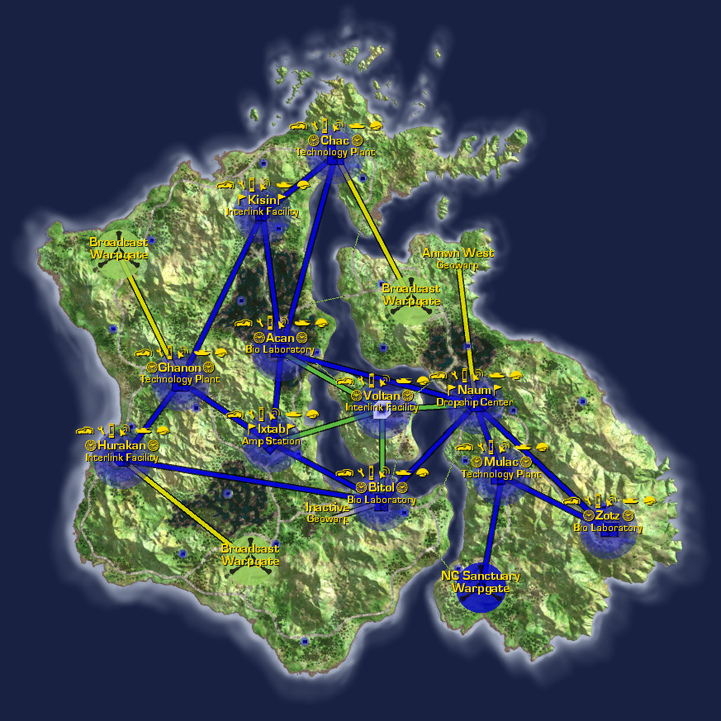
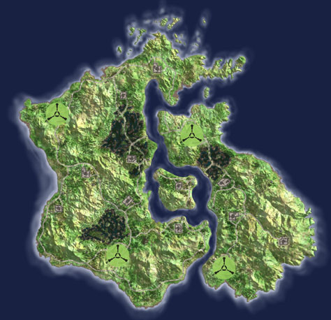

## Continental Data

|                                          |                                                                                    |
| ---------------------------------------- | ---------------------------------------------------------------------------------- |
| Category:                                | Caustic Atmosphere                                                                 |
| Climate:                                 | Humid, Temperate                                                                   |
| Landmass:                                | Continent                                                                          |
| Terrain:                                 | Swampy lowlands, lush interiors, causeways, rolling hills, slow rivers, mountains. |
| [Facilities](Facilities "wikilink"):     | 11                                                                                 |
| [Towers](Tower "wikilink"):              | 18                                                                                 |
| Active [Warpgates](Warpgate "wikilink"): | 4                                                                                  |
| Active [Geowarps](Geowarp "wikilink"):   | 1                                                                                  |
| [Capitol](Capitol "wikilink"):           | [Interlink Facility](Interlink_Facility "wikilink") [Voltan](Voltan "wikilink")    |

## Description

Heavy clouds hang in the atmosphere here and the oxygen levels are low,
although the air is dense with other elements. (Troops regularly
activate their bio-containment fields when operating on Hossin.)

This lush, temperate continent has low-lying hills and boggy swamps
dotting the terrain that lure the unwary into thinking straight-line of
travel would be easiest, much to their later dismay.

The [continent](continent "wikilink") is divided by a river in the
center which splits and surrounds an island on its way through the
continent. On this island is the [Capitol](Capitol "wikilink") of
Hossin, [Voltan](Voltan "wikilink"), an [Interlink
Facility](Interlink_Facility "wikilink").

Hossin is a [Home Continent](Home_Continent "wikilink"). A
[Sanctuary](Sanctuary "wikilink") warpgate links to the
[Mulac](Mulac "wikilink") Technology Plant in the south east. The
continent's other [warpgates](warpgate "wikilink") link from
[Ghanon](Ghanon "wikilink") to [Sungrey](Sungrey "wikilink") on
[Amerish](Amerish "wikilink"), [Hurakan](Hurakan "wikilink") to
[Wakea](Wakea "wikilink") on [Searhus](Searhus "wikilink"), and
[Chac](Chac "wikilink") to [Baal](Baal "wikilink") on
[Ishundar](Ishundar "wikilink"). See [Home
Continent](Home_Continent "wikilink") for the current empire sanctuary
links.

This continent is also refered to as
[Hos](Acronyms_and_Slang "wikilink").

Source: PlanetSide In-game descriptions, pre- and
post-[Bending](Bending "wikilink").

## Base [Facilities](Facilities "wikilink")

### [Amp Stations](Amp_Station "wikilink")

- [Ixtab](Ixtab "wikilink") ([Sub-Capitol](Sub-Capitol "wikilink"))

### [Bio Laboratories](Bio_Laboratories "wikilink")

- [Acan](Acan "wikilink") (Sub-Capitol)
- [Bitol](Bitol "wikilink") (Sub-Capitol)
- [Zotz](Zotz "wikilink")

### [Dropship Centers](Dropship_Centers "wikilink")

- [Naum](Naum "wikilink") (Sub-Capitol)

### [Interlink Facilities](Interlink_Facilities "wikilink")

- [Hurakan](Hurakan "wikilink")
- [Kisin](Kisin "wikilink")
- [Voltan](Voltan "wikilink") ([Capitol](Capitol "wikilink"))

### [Technology Plants](Technology_Plant "wikilink")

- [Chac](Chac "wikilink")
- [Ghanon](Ghanon "wikilink")
- [Mulac](Mulac "wikilink")

[Category:Locations](Category:Locations "wikilink")
