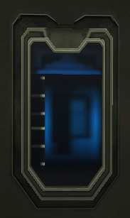

**IFF** stands for "Identify Friend from Foe". Objects that use this
technology differentiate between enemies and friendlies, allowing
friendlies to activate and use its benefits but disallowing enemies.
Objects which use IFF are:

- Exterior [tower](tower "wikilink") and
  [facility](facility "wikilink") doors, as well as [Control
  Console](Control_Console "wikilink"),
  [generator](generator "wikilink"), and [spawn
  room](spawn_room "wikilink") doors.
- [Equipment terminals](Equipment_terminal "wikilink")
- [Medical terminals](Medical_terminal "wikilink")
- [Lockers](Locker "wikilink")
- [Vehicles](Vehicle "wikilink")
- [Spawn tubes](Spawn_tube "wikilink")
- Facility [Main terminals](Main_terminal "wikilink")

Most IFF objects can be [hacked](hack "wikilink"), temporarily disabling
the IFF lock on them and allowing all units, Friend or Foe, to access
them. Notable exceptions include vehicles, which change ownership to
that of the hacking soldier, and spawn tubes and main terminals, which
cannot be hacked. Hacked IFF locks can be re-locked by a friendly
soldier using a [REK](REK "wikilink").

[category:Terminology](category:Terminology "wikilink")
