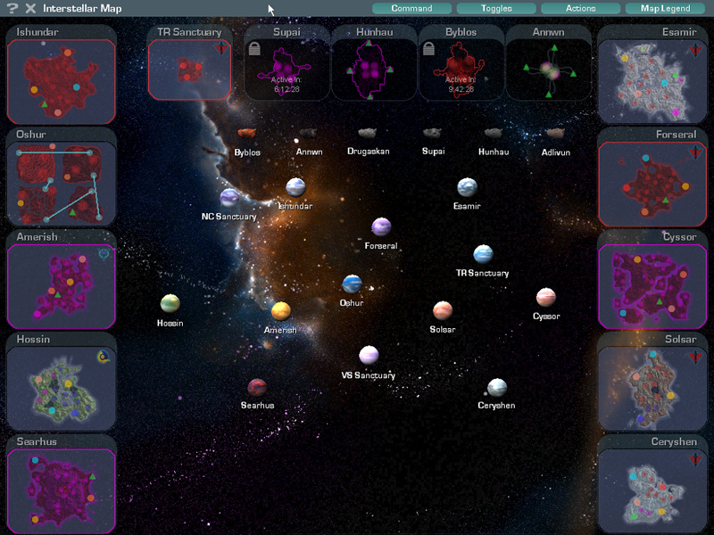

 Overhead Map of the
[planets](planet "wikilink") and of Auraxian space, showing the
[Galactic Lattice](Galactic_Lattice "wikilink") network between the
worlds and their [continents](continent "wikilink"). Accessed with the
"G" key after you have opened up the [Continental
Map](Continental_Map "wikilink") with the "M" key.

When you select a single planet, it will reveal color-coded lines to
other worlds that have fixed warpgate links to it. Blue rings will
encircle a planet that you can [Broadcast Warp](broadcast "wikilink")
to. When you enter a [broadcast
warpgate](broadcast_warpgate "wikilink"), the Interstellar Map will
automatically open and allow you to immediately choose your destination.

Planetary data such as ownership status, capitol location, and number of
[facilities](facilities "wikilink") will scroll from the bottom of the
map. Mini-screens at the top of the map display
[Cavern](caverns "wikilink") and [Sanctuary](Sanctuary "wikilink")
status.

Selecting a planet or cavern will also highlight its hosted continent on
the side of the screen, with thin lines leading to the target world for
quick referance. Each mini-window will also show the [Continental
lock](Continental_lock "wikilink") and [Population
lock](Population_lock "wikilink") status of each continent, the empire
[SOIs](SOI "wikilink") for each base, as well as any
[hotspots](hotspot "wikilink") on the surface.

[LLU](LLU "wikilink"), [Module](Modules "wikilink"),
[Squad](Squad "wikilink"), and [Platoon](Platoon "wikilink")-member
locations will also display on these continent windows. Your current
location will appear as a white arrow.

Double-clicking on a continent or planet will open up the [Continental
Map](Continental_Map "wikilink") of that world or cavern.

---

Add toggle descrptions for population, etc.

[category:HUD](category:HUD "wikilink")
[category:Terminology](category:Terminology "wikilink")
