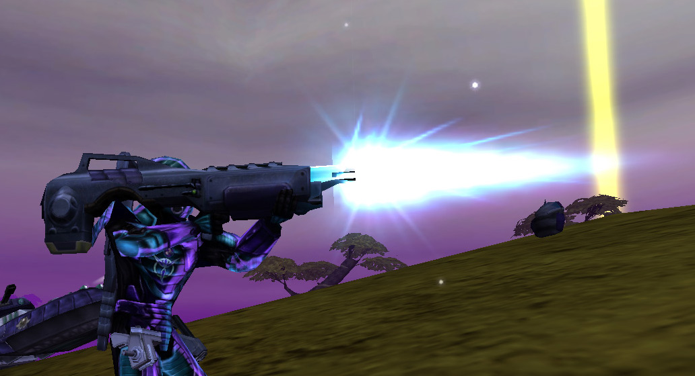

 Soldier firing a Lancer\]\]

|                            |                                                   |
| -------------------------- | ------------------------------------------------- |
| **Certification Required** | [Anti-Vehicular](Anti-Vehicular "wikilink")       |
| **Empire**                 | [Vanu Sovereignty](Vanu_Sovereignty "wikilink")   |
| **Primary Mode**           | Energy Beam                                       |
| **Secondary Mode**         | \-                                                |
| **Ammunition**             | [Large Energy Cell](Large_Energy_Cell "wikilink") |
| **Range**                  | 300 m                                             |
| **Inventory Dimensions**   | 3 x 9 (Rifle Holster)                             |
| **Magazine Capacity**      | 6                                                 |
| **Zoom**                   | 4x                                                |

**Lancer**

The [Vanu Sovereignty](Vanu_Sovereignty "wikilink")'s
[Anti-Vehicular](Anti-Vehicular "wikilink") weapon, the
[Lancer](Lancer "wikilink"), feature a fast-moving energy projectile
with a small [cone of fire](cone_of_fire "wikilink"). However, it takes
approximately 1 second for the weapon to charge prior to each shot,
necessitating the soldier to lead moving targets. The Lancer has a
greater range than the [Phoenix](Phoenix "wikilink") and
[Striker](Striker "wikilink").

As an interesting sidenote, this is the only non-[MAX](MAX "wikilink")
[Vanu](VS "wikilink") beam weapon not to use the universal [Energy
Cell](Energy_Cell "wikilink") ammo.

Shots to kill:

|                                   |             |
| --------------------------------- | ----------- |
| [MAX](MAX "wikilink")             | 6 shots     |
| [Lightning](Lightning "wikilink") | 9 shots     |
| [Prowler](Prowler "wikilink")     | 22(?) shots |
| [Magrider](Magrider "wikilink")   | 17(?) shots |
| [Vanguard](Vanguard "wikilink")   | 23(?) shots |

(The above numbers are taken with full Armor; no Vehicle Shields
applied)

[Category:Game Items](Category:Game_Items "wikilink")
[Category:Weapons](Category:Weapons "wikilink") [Category:Vanu
Sovereignty Weapons](Category:Vanu_Sovereignty_Weapons "wikilink")
