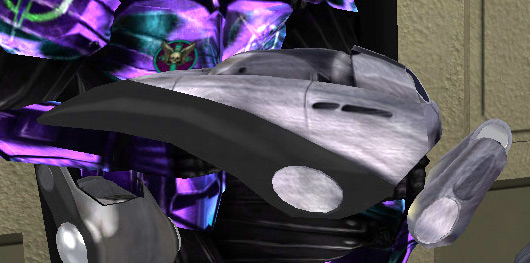

 soldier defends a [Control
Console](Control_Console "wikilink") with his Maelstrom\]\]

|                            |                                                                 |
| -------------------------- | --------------------------------------------------------------- |
| **Certification Required** | [Heavy Assault](Heavy_Assault "wikilink")                       |
| **Empire**                 | [Common Pool](Common_Pool "wikilink")                           |
| **Primary Mode**           | Vortex Whip                                                     |
| **Secondary Mode**         | Chain-Lash Grenade                                              |
| **Tertiary Mode**          | "Sticky" Chain-Lash Grenade                                     |
| **Ammunition**             | [Maelstrom Capacitor Unit](Maelstrom_Capacitor_Unit "wikilink") |
| **Range**                  | Vortex Whip: 40m                                                |
| **Inventory Dimensions**   | 3 x 9 (Rifle Holster)                                           |
| **Magazine Capacity**      | 150                                                             |
| **Zoom**                   | 2x                                                              |

**Maelstrom**

This is an [Ancient Technology](Ancient_Technology "wikilink") weapon.
In its Primary mode, when fired it extends a "Vortex Whip," a stream of
energy that extends approximately 50m from the weapon and does
continuous damage to its target as long as it remains in contact.

The secondary mode launches a Chain-Lash grenade that explodes on
contacting any soldier or vehicle, then attempts to "Lash" other nearby
targets, much the same as the [Lasher](Lasher "wikilink"). Unlike the
Lasher, the lash from a [Maelstrom](Maelstrom "wikilink") will hit
anyone within (Approx.) 5m of the person hit, meaning it has the
capability to lash all people within (approx.) 5m of anyone who has been
lashed (The [Lasher](Lasher "wikilink") merely hits anyone within 5m of
the orb itself, it cannot jump from person to person). It takes 5
grenades to kill a soldier wearing a [Reinforced
Exo-Suit](Reinforced_Exo-Suit "wikilink"). Be prepared to get plenty of
[Grief points](Grief_points "wikilink") if you chain-lash a bunch of
friendlies!

The tertiary mode is the same as the secondary, except the Chain-Lash
grenade will explode after 3 seconds or upon contacting an enemy. This
will allow its user to bounce Chain-Lash grenades off of walls to hit
targets around corners.

The Maelstrom is a powerful base defense tool as the chain lash can hurt
an unlimited number of enemies in theory. The Maelstrom is also possibly
the most ammo-hungry weapon in PlanetSide. It's best used in defensive
roles inside a friendly SOI that has an [Equipment
Module](Equipment_Module "wikilink") installed so that the ammo
recharges automatically. If used in other circumstances, one should
carry plenty of ammo for it, especially if you plan on using the
secondary or tertiary modes, as it takes 10 ammo "points" to fire one
grenade.

On the surface, in addition to the [Heavy
Assault](Heavy_Assault "wikilink")
[certification](certifications "wikilink"), the base must have
[Equipment Module](Equipment_Module "wikilink") installed (or the
equipment [Module benefit](Module_benefit "wikilink") via
[Lattice](Lattice "wikilink")) for the weapon to be available at
[Equipment Terminals](Equipment_Terminal "wikilink").

Shots to kill (Vortex Whip):

|                                                       |           |
| ----------------------------------------------------- | --------- |
| [Standard Exo-Suit](Standard_Exo-Suit "wikilink")     | 12 shots  |
| [Agile Exo-Suit](Agile_Exo-Suit "wikilink")           | 15 shots  |
| [Reinforced Exo-Suit](Reinforced_Exo-Suit "wikilink") | 23 shots  |
| [MAX](MAX "wikilink")                                 | 130 shots |

(The above numbers are taken with 100 Health and full Armor; no
[MedKits](MedKit "wikilink"), [Implants](Implants "wikilink") or [Empire
Incentives](Empire_Incentives "wikilink") applied)

[Category:Game Items](Category:Game_Items "wikilink")
[Category:Weapons](Category:Weapons "wikilink") [Category:Common Pool
Weapons](Category:Common_Pool_Weapons "wikilink")
