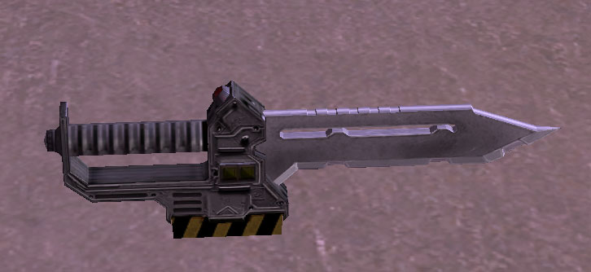

|                            |                                                 |
| -------------------------- | ----------------------------------------------- |
| **Certification Required** | [Standard Assault](Standard_Assault "wikilink") |
| **Empire**                 | [New Conglomerate](New_Conglomerate "wikilink") |
| **Primary Mode**           | Slash                                           |
| **Secondary Mode**         | Magnetic Attack                                 |
| **Ammunition**             | \-                                              |
| **Inventory Dimensions**   | 1 x 1 (Knife Holster)                           |
| **Magazine Capacity**      | \-                                              |
| **Zoom**                   | None                                            |

**Mag-Cutter**

Standard issue in all [Infiltration
Suits](Infiltration_Suit "wikilink"), [Standard
Exo-Suit](Standard_Exo-Suit "wikilink"), [Agile
Exo-Suit](Agile_Exo-Suit "wikilink") and [Reinforced
Exo-Suit](Reinforced_Exo-Suit "wikilink"), the Mag-Cutter is a generally
a weapon of last resort. (Default key: 5)

However, if a Soldier can manage to get close enough to use it, it does
do a considerable amount of damage, particularly in secondary mode, with
the aid of a [Melee Booster](Melee_Booster "wikilink") implant.

Many Infiltrators use this weapon exclusively, as it requires no ammo,
and no holster space, only a steely nerve.

Secondary mode activates the powered magnetic edge of the blade,
doubling the damage per stab, but also creating a distinctive and
clearly audible noise as it does so.

(Note: This weapon is part of the soldier's armor and so cannot be
looted.)

[Category:Game Items](Category:Game_Items "wikilink")
[Category:Weapons](Category:Weapons "wikilink") [Category:New
Conglomerate Weapons](Category:New_Conglomerate_Weapons "wikilink")
