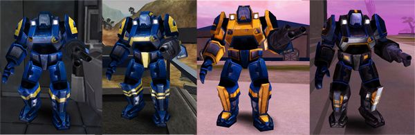
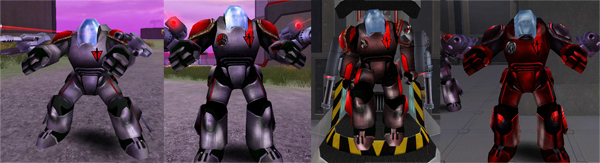
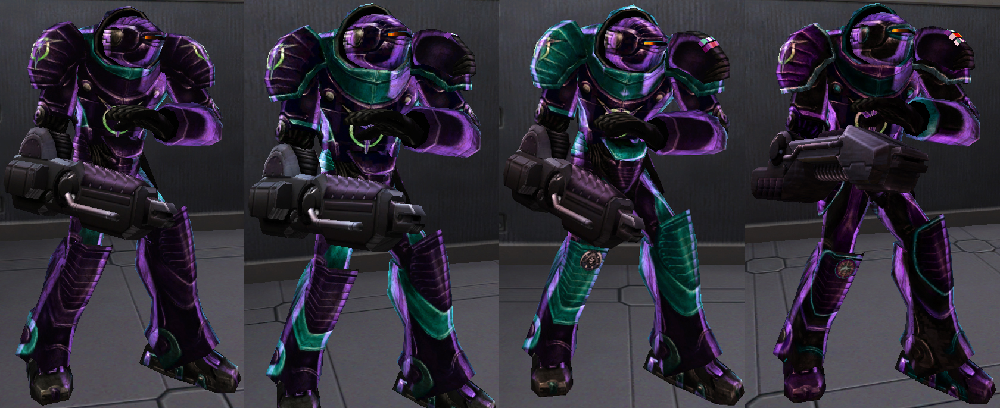

The **Mechanized Assault Exo-Suit**—or **MAX** unit—provides a huge
amount of protection for its wearer (650 armor points). The heavy armor
means that MAX units turn and move slower than typical infantry. All MAX
units have a "Run-Mode" function that enables the user to travel faster
than normal at the cost of all weapons being disabled while in this
mode. Each [Empire](Empire "wikilink") has its own MAX armor, and the
integrated weapon is tuned for one of three purposes: Anti-Infantry,
Anti-Vehicle, and Anti-Aircraft.

Each Empire's MAX units also have a special ability which improves their
effectiveness in the field.

Each type of armor has its own
[certification](certifications "wikilink"), although the
[Uni-MAX](<Uni-MAX_(Certification)> "wikilink") certification gives access
to all three types of MAX armor at a reduced cost.

## [New Conglomerate](New_Conglomerate "wikilink")

 MAX Armor at, from left to
right, [Battle Rank](Battle_Rank "wikilink") 1, 7, 14 and 25\]\]
Anti-Infantry: [Scattercannon](Scattercannon "wikilink")
Anti-Vehicle: [Falcon](Falcon "wikilink")
Anti-Aircraft: [Sparrow](Sparrow "wikilink")
_New Conglomerate_ MAX Units are equipped with a light energy shield.
The shield draws power from from an onboard MAX Capacitor. Once
depleted, the capacitor will recharge. The MAX Unit cannot fire when the
Shield is active.

## [Terran Republic](Terran_Republic "wikilink")

 MAX Armor at, from left to
right, [Battle Rank](Battle_Rank "wikilink") 1, 7, 14 and 25\]\]
Anti-Infantry: [Dual-Cycler](Dual-Cycler "wikilink")
Anti-Vehicle: [Pounder](Pounder "wikilink")
Anti-Aircraft: [Burster](Burster "wikilink")
_Terran Republic_ MAX Units have 2 special abilities. The first is the
ability to "lock down", doubling their rate of fire and reducing the
[Cone of fire](Cone_of_fire "wikilink") at the cost of no movement.
Aiming is possible, but the range of pivot is extremely reduced. The
second is "overdrive" which, similar to the NC and VS MAXes, works off
capacitor. When active, the MAX can fire at 1.5x the normal rate and
still move around. Overdrive is "all-or-nothing," meaning that once
active, it cannot be turned off until the capacitor is drained. The MAX
may not lock down or auto-run while in overdrive. MAXes with overdrive
active will glow red.

## [Vanu Sovereignty](Vanu_Sovereignty "wikilink")

 MAX Armor at, from left to right,
[Battle Rank](Battle_Rank "wikilink") 1, 7, 14 and 25\]\] Anti-Infantry:
[Quasar](Quasar "wikilink")
Anti-Vehicle: [Comet](Comet "wikilink")
Anti-Aircraft: [Starfire](Starfire "wikilink")
_Vanu Sovereignty_ MAX Units are equipped with limited jump-jets. These
jump jets draw power from an onboard MAX Capacitor. Once depleted, the
capacitor will recharge.

[Category:Game Items](Category:Game_Items "wikilink")
