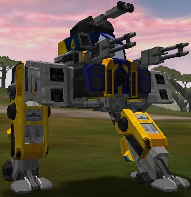
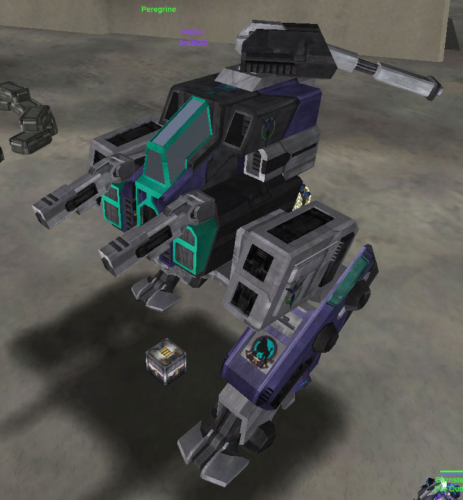

 Peregrine with dual
[Anti-Tank Machine Guns](Anti-Tank_Machine_Gun "wikilink") and a
[Particle Cannon](Particle_Cannon "wikilink")\]\]

The **Peregrine** is the gunner variant of [BattleFrame
Robotics](BattleFrame_Robotics "wikilink") developed by the [New
Conglomerate](New_Conglomerate "wikilink").

Gunner variants have, in addition to the pilot weapons, an extra gunner
pod on their backs which can be manned by a second soldier. They also
have more armor and a faster shield regeneration rate than their flight
counterparts, which gives them greater "staying power."

In the gunner variant, the shields will be activated whenever a soldier
enters either the pilot or gunner's seat, and will remain active as long
as someone occupies one of these positions. Emptying both positions will
deactivate the shields, leaving the BFR directly vulnerable to attack or
[jacking](jack "wikilink").

The Flight Variant of the Peregrine is the [Eagle](Eagle "wikilink").

## **Pilot Weapons**

The pilot weapons available to the Peregrine are:

- The [Hammer](Hammer "wikilink") (Anti-Infantry)
- The [Sparrow](<Sparrow_(BFR)> "wikilink") Missile Pod (Anti-Aircraft)
- The [Anti-Tank Machine Gun](Anti-Tank_Machine_Gun "wikilink")
  (Anti-Vehicular)
- The [NTU Siphon](NTU_Siphon "wikilink")
- The [Armor Siphon](Armor_Siphon "wikilink") (Anti-Vehicular)

The pilot can equip two of these weapons, in any combination.
Additionally, it is possible to manually deactivate one of the weapons,
using them one at a time (one weapon must always remain active,
however).

-[jacked](jack "wikilink")
Peregrine, operating with a full crew of pilot and gunner. Equipped with
two [Hammers](Hammer "wikilink") and a [Particle
Cannon](Particle_Cannon "wikilink")\]\]

## **Gunner Weapons**

The gunner weapons available to the Peregrine are

- The [Particle Cannon](Particle_Cannon "wikilink") (Anti-Vehicular)
- The [Rocket Pod](<Rocket_Pod_(BFR)> "wikilink") (Anti-Infantry)

Only one gunner weapon can be used at a time.

[Category:Game Items](Category:Game_Items "wikilink")
