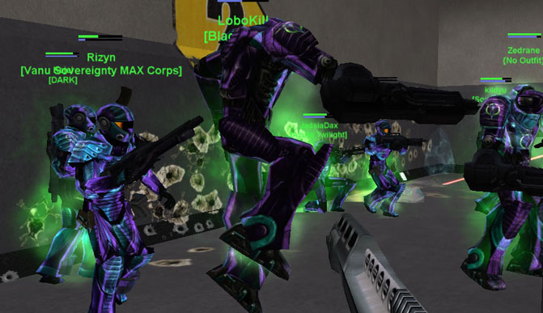

There are a few different types of **plasma** found in
[PlanetSide](PlanetSide "wikilink"), all of them dangerous. All types
continue to do damage after the initial impact. Soldiers can only take
two instances of this secondary damage at the same time. Additional
instances are ignored until the first one wears off. Note, however, that
the damage taken from the initial impact is unlimited.

## Grenade Plasma

 troops covered by green
clouds of [Plasma](Plasma "wikilink")\]\]

The first and most common occurance of the fourth state of matter.

Ignited by [Plasma grenades](Plasma_grenade "wikilink"), this distinct
green fire can be applied to a large group very quickly via hand
[grenades](grenade "wikilink"), the [Thumper](Thumper "wikilink"), or
the [Punisher](Punisher "wikilink").

## [VS](VS "wikilink") [MAX](MAX "wikilink") Plasma

These aggravated-damage plasma fields are
[Anti-Vehicular](Anti-Vehicular "wikilink") in nature, being distributed
by the orbs of the [Starfire](Starfire "wikilink") and
[Comet](Comet "wikilink") [MAXes](MAX "wikilink"), as well as the
[Starfire BFR Weapon](<Starfire_(BFR)> "wikilink") of the [Vanu
Sovereignty](Vanu_Sovereignty "wikilink"). Soldiers taking damage from
this type of plasma glow purple.

## [BFR](BFR "wikilink") [Plasma Mortars](Plasma_Mortar "wikilink")

A Gunner weapon only, these are long-range ballistic mortars intended to
injure [infantry](infantry "wikilink"). Soldiers taking damage from this
type of plasma flash white.

## Other

Though technically not plasma, taking burn damage from the
[Dragon](Dragon "wikilink") has very similar effects to plasma and
shares the maximum of 2 instances of burn damage from the secondary fire
mode. Soldiers burning from the Dragon will glow orange.

[Category:Terminology](Category:Terminology "wikilink") [Category:Game
Guides](Category:Game_Guides "wikilink")
[Category:Weapons](Category:Weapons "wikilink")
