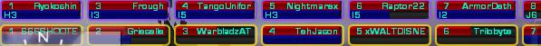

A platoon is a large group of soldiers with multiple
[squads](Squad "wikilink"). A platoon:

- Does not share [experience points](Experience_Points "wikilink")
  with other members unless they are in the same
  [squad](Squad "wikilink").
- Creates a platoon chat group that is used to alert members of
  threats, needs, and orders.
- Allows the members of the platoon to see the waypoints of all the
  [squads](Squad "wikilink") in the platoons created by [Squad
  Leaders](Squad_Leader "wikilink") and the [Platoon
  Leader](Platoon_Leader "wikilink") assuming the [Squad
  Leader](Squad_Leader "wikilink") and [Platoon
  Leader](Platoon_Leader "wikilink") are atleast [Command
  Rank](Command_Rank "wikilink") 1.
- Allows the [Platoon Leader](Platoon_Leader "wikilink") to create
  battle plans on the [Continental Map](Continental_Map "wikilink")
  for the entire platoon. (Requires [Command
  Rank](Command_Rank "wikilink") 3 or above)

Here is a picture of the platoon list in the [Heads-up
Display](Heads-up_Display "wikilink")
([HUD](Acronyms_and_Slang "wikilink"))

[Category:Terminology](Category:Terminology "wikilink") [Category:Game
Guides](Category:Game_Guides "wikilink")
