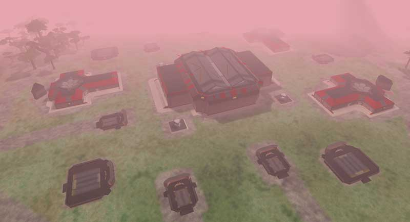

 [Sanctuary](Sanctuary "wikilink")
Villa \]\] A Sanctuary Villa is a homebase located near a
[warpgate](warpgate "wikilink"). Each Villa is made up of 1 [HART
building](HART_building "wikilink"), 3 [Respawn
Buildings](Respawn_Building "wikilink"), [Repair/Rearm
Silos](Repair/Rearm_Silo "wikilink"), [BFR Sheds](BFR_Shed "wikilink"),
[teleporters](teleporter "wikilink"), several of each type of [Vehicle
Terminal](Vehicle_Terminal "wikilink"), and a nearby
[tower](tower "wikilink").

There are three Villas in each Empire's
[Sanctuary](Sanctuary "wikilink").

[Category:Locations](Category:Locations "wikilink")
