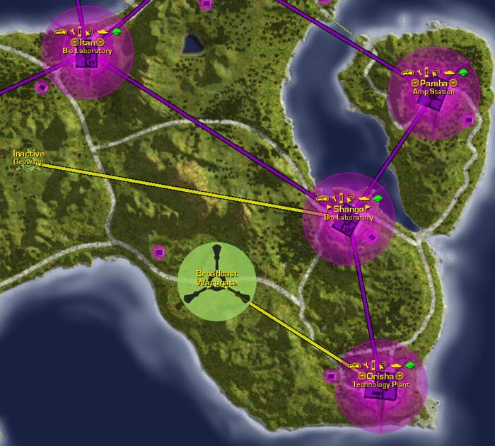

 [Bio
Laboratory](Bio_Laboratory "wikilink") on SE [Cyssor](Cyssor "wikilink")

[Lattice](Lattice "wikilink") links:

- [Orisha](Orisha "wikilink"), [Tech Plant](Tech_Plant "wikilink")
- [Itan](Itan "wikilink"), [Bio Laboratory](Bio_Laboratory "wikilink")
- [Pamba](Pamba "wikilink"), [Amp Station](Amp_Station "wikilink")
- [Geowarp](Geowarp "wikilink")

Shango stands near a land bridge to [Pamba](Pamba "wikilink")'s island,
and the channel between them is a short traverse for amphibious and air
vehicles.

[Category:Facilities](Category:Facilities "wikilink")
