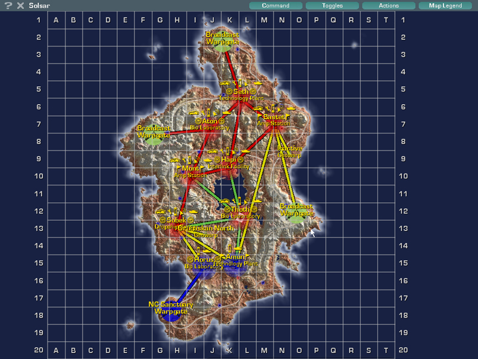
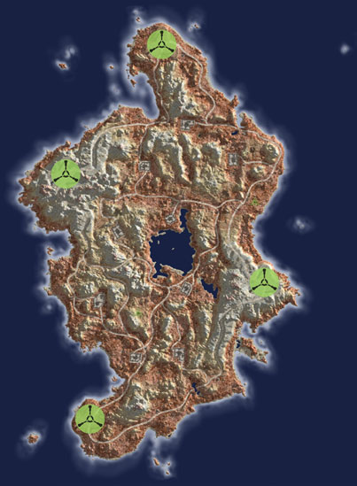
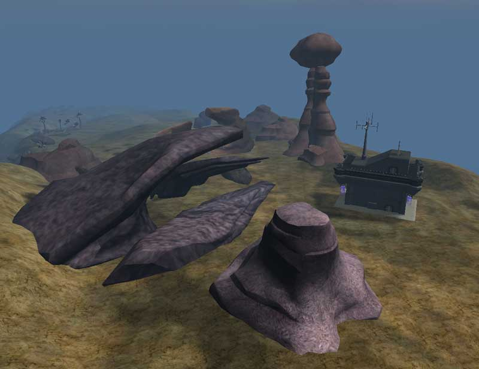

## Continental Data

|                                          |                                                                             |
| ---------------------------------------- | --------------------------------------------------------------------------- |
| Category:                                | Inner Planet                                                                |
| Climate:                                 | Desert                                                                      |
| Landmass:                                | Continent                                                                   |
| Terrain:                                 | Plains, cliffs, mountains, plateaus, oasis, rocky shores                    |
| [Facilities](Facilities "wikilink"):     | 9                                                                           |
| [Towers](Tower "wikilink"):              | 18                                                                          |
| Active [Warpgates](Warpgate "wikilink"): | 4                                                                           |
| Active [Geowarps](Geowarp "wikilink"):   | 1                                                                           |
| [Capitol](Capitol "wikilink"):           | [Interlink Facility](Interlink_Facility "wikilink") [Hapi](Hapi "wikilink") |

## Description

\]\] The large central
oasis of Solsar is flanked by two warp gates on plateaus nearby, making
it a unique tactical situation.

There are relatively few roads and very rough off-road terrain here,
making the bases more defensible to standard massed armor attacks.

---

Source: Planetside In-game descriptions, pre- and
post-[Bending](Bending "wikilink").

This continent is also refered to as
[Sol](Acronyms_and_Slang "wikilink"). Solsar is a [Home
Continent](Home_Continent "wikilink") with a
[Sanctuary](Sanctuary "wikilink") link to [Horus](Horus "wikilink"). See
[Home Continent](Home_Continent "wikilink") for the current empire
sanctuary links.

## Base [Facilities](Facilities "wikilink")

### [Amp Stations](Amp_Station "wikilink")

- [Mont](Mont "wikilink") ([Sub-Capitol](Sub-Capitol "wikilink"))
- [Bastet](Bastet "wikilink")

### [Bio Laboratories](Bio_Laboratories "wikilink")

- [Aton](Aton "wikilink")
- [Horus](Horus "wikilink")
- [Thoth](Thoth "wikilink") ([Capitol](Capitol "wikilink"))

### [Dropship Centers](Dropship_Center "wikilink")

- [Sobek](Sobek "wikilink") (Sub-Capitol)

### [Interlink Facilities](Interlink_Facilities "wikilink")

- [Hapi](Hapi "wikilink") (Sub-Capitol)

### [Technology Plants](Technology_Plant "wikilink")

- [Amun](Amun "wikilink") (Sub-Capitol)
- [Seth](Seth "wikilink")

[Category:Locations](Category:Locations "wikilink")
