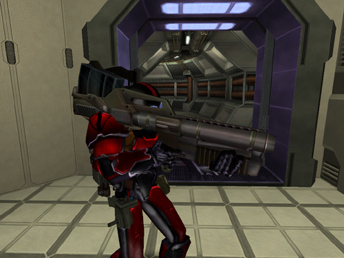

 Striker\]\]

|                            |                                               |
| -------------------------- | --------------------------------------------- |
| **Certification Required** | [Anti-Vehicular](Anti-Vehicular "wikilink")   |
| **Empire**                 | [Terran Republic](Terran_Republic "wikilink") |
| **Primary Mode**           | Homing Missile                                |
| **Secondary Mode**         | Dumb Fire                                     |
| **Ammunition**             | [Striker Missile](Striker_Missile "wikilink") |
| **Range**                  | 240 m                                         |
| **Inventory Dimensions**   | 3 x 9 (Rifle Holster)                         |
| **Magazine Capacity**      | 5                                             |
| **Zoom**                   | 4x                                            |

**Striker**

The [Striker](Striker "wikilink") is the [Terran
Republic](Terran_Republic "wikilink")'s
[Anti-Vehicular](Anti-Vehicular "wikilink") weapon. In primary mode, the
[Striker](Striker "wikilink") can "lock on" to any vehicle,
[MAX](Mechanized_Armored_Exo-Suit "wikilink") unit, [Phalanx wall
turret](Phalanx "wikilink"), or [Spitfire
Turret](Spitfire_Turret "wikilink") which will guide the missle to its
target. (The [reticle](reticle "wikilink") must be kept on the target to
maintain the "lock.")

In secondary mode, the [Striker](Striker "wikilink") fires an unguided
"dumbfire" missile.

Shots to kill:

|                                   |          |
| --------------------------------- | -------- |
| [MAX](MAX "wikilink")             | 6 shots  |
| [Lightning](Lightning "wikilink") | 12 shots |
| [Prowler](Prowler "wikilink")     | 36 shots |
| [Magrider](Magrider "wikilink")   | 28 shots |
| [Vanguard](Vanguard "wikilink")   | 36 shots |

(The above numbers are taken with full Armor; no Vehicle Shields
applied)

[category:Terran Republic
Weapons](category:Terran_Republic_Weapons "wikilink")

[Category:Game Items](Category:Game_Items "wikilink")
[Category:Weapons](Category:Weapons "wikilink")
