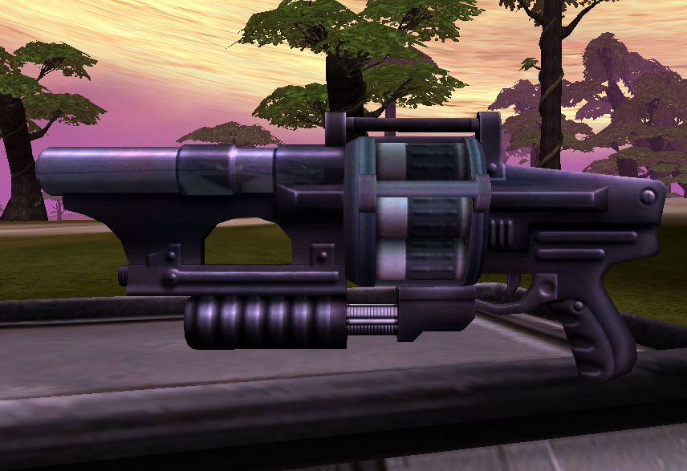

|                            |                                                                                                                                        |
| -------------------------- | -------------------------------------------------------------------------------------------------------------------------------------- |
| **Certification Required** | [Special Assault](Special_Assault "wikilink")                                                                                          |
| **Empire**                 | [Common Pool](Common_Pool "wikilink")                                                                                                  |
| **Primary Mode**           | Explode on contact                                                                                                                     |
| **Secondary Mode**         | Two Second Fuse                                                                                                                        |
| **Ammunition**             | [Jammer](Jammer_grenade "wikilink"), [Plasma](Plasma_grenade "wikilink") or [Fragmentation grenades](Fragmentation_grenade "wikilink") |
| **Inventory Dimensions**   | 3 x 6 (Rifle Holster)                                                                                                                  |
| **Magazine Capacity**      | 6                                                                                                                                      |
| **Zoom**                   | 2x                                                                                                                                     |

**Thumper**

Also known as the "Grief Machine" when in the hands of an inexperienced
user, the [Thumper](Thumper "wikilink") is a very powerful
anti-personnel grenade launcher. Capable of equipping all types of
grenade rounds ([Fragmentation](Fragmentation_grenade "wikilink"),
[Plasma](Plasma_grenade "wikilink"),
[Jammer](Jammer_grenade "wikilink")), it is a versatile weapon and can
be quite effective in the hands of a seasoned grenadier. The weapon has
two fire modes, a primary detonate on contact mode, as well as a
secondary two-second- fuse mode that also detonates upon striking an
enemy.

Ideal uses for the thumper are in [Back Door](Back_Door "wikilink") or
[Tower](Towers "wikilink") defense. The two-second-fuse setting allows
the user to fire around corners, saturating a target or area without
visual contact. In addition, when loaded with a supply of [Jammer
grenades](Jammer_grenade "wikilink"), they can be quite handy
eliminating minefields on [Galaxy](Galaxy "wikilink") drops when a
Command [EMP](EMP "wikilink") is not available.

Aspiring Special Assault soldiers should start by loading [Fragmentation
grenades](Fragmentation_grenade "wikilink") into their Thumper. Many new
players complain of a prompt [grief-lock](grief-lock "wikilink") due to
accidental team damage while using the Thumper, often while launching
[Plasma grenades](Plasma_grenade "wikilink"). [Fragmentation
grenades](Fragmentation_grenade "wikilink") have a smaller explosion
radius and lack the aggravated damage-over-time of their Plasma
counterparts, and as such, produce less grief for the Thumper user.

This weapon is one of three available with the [Special
Assault](Special_Assault "wikilink") cert, the others being the [Rocklet
Rifle](Rocklet_Rifle "wikilink") and the
[Radiator](Radiator "wikilink").

Merit-qualified kills with the Thumper count towards both the
[Grenadier](Grenadier "wikilink") and [Special
Assault](<Special_Assault_(Merit)> "wikilink") [Merit
Commendations](Merit_Commendations "wikilink").

[category:Common Pool Weapons](category:Common_Pool_Weapons "wikilink")
[category:Weapons](category:Weapons "wikilink")

[Category:Game Items](Category:Game_Items "wikilink")
