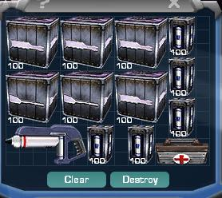

 trunk filled with ammunition and
extra repair gear.\]\]

Similar to a soldier's [Inventory](Inventory "wikilink"), trunks are the
compartments in [vehicles](Vehicle_Index "wikilink") for storing
[ammunition](ammunition "wikilink") and supplies. Most vehicle weapons
are fed directly from the trunk, with the exceptions being the
[Flail](Flail "wikilink") and [Switchblade](Switchblade "wikilink"),
which use on-board capacitors for their ammunition.

Trunks are of varying size in relation to the vehicle's mass and
function.

Vehicles with weapon systems have a default loadout of ammuntion for
their guns loaded into the trunk on creation, but these contents may be
changed quickly at a [Repair/Rearm Silo](Repair/Rearm_Silo "wikilink"),
[Landing Pad](Landing_Pad "wikilink"), or
[Lodestar](Lodestar "wikilink"). These terminals also allow depleted
ammunition to be instantly restocked in the trunk, via the vehicle
[Favorites](Favorites "wikilink") menu.

In emergencies, i.e only [Towers](Tower "wikilink") and [Advanced Mobile
Stations](Advanced_Mobile_Station "wikilink") available, the trunk may
be manually restocked by the driver using the 'Vehicles' tab at any
standard [Equipment terminal](Equipment_terminal "wikilink"), and
carrying the appropriate boxes back to the vehicle's trunk.

The trunk may be used to carry any items at all, not just vehicle
ammunition, and as most ammo boxes are 4x4, there is usually room for
extra items down the sides: extra [Armor
Canisters](Armor_Canister "wikilink"), [Adaptive Construction
Engines](Adaptive_Construction_Engine "wikilink"), etc. These items will
save into any vehicle Favorite preset along with the ammo, provided you
have the appropriate [certification](certification "wikilink").

(Note: The trunk may be locked like the Driver, Gunner and Passenger
seats; set to Driver only, Squad Only and Empire - remember to unlock it
if you want your gunner to do a manual reload.)

[ANTs](Advanced_Nanite_Transport "wikilink") and
[AMSes](Advanced_Mobile_Station "wikilink") do not have trunks.
[Lodestars](Lodestar "wikilink"), [Routers](Router "wikilink"),
[Wraiths](Wraith "wikilink"), [Phantasms](Phantasm "wikilink"),
[Flails](Flail "wikilink"), and [Switchblades](Switchblade "wikilink")
have empty trunks by default.

[Category:Terminology](Category:Terminology "wikilink") [Category:Game
Items](Category:Game_Items "wikilink") [Category:Game
Guides](Category:Game_Guides "wikilink")
