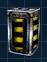

 Commander
using a [Nano Dispenser](Nano_Dispenser "wikilink") with an Upgrade
Canister\]\]

[Upgrade Canisters](Upgrade_Canister "wikilink") are used in [Nano
Dispensers](Nano_Dispenser "wikilink") to upgrade [Wall
Turrets](Wall_Turrets "wikilink") to be able to fire either
Anti-Aircraft or Anti-Armor rounds in addition to the standard
ammunition. One canister is used per upgrade and can be loaded into the
Nano Dispenser by using the "change ammo type" key (default: "X").

[Category:Game Items](Category:Game_Items "wikilink")
