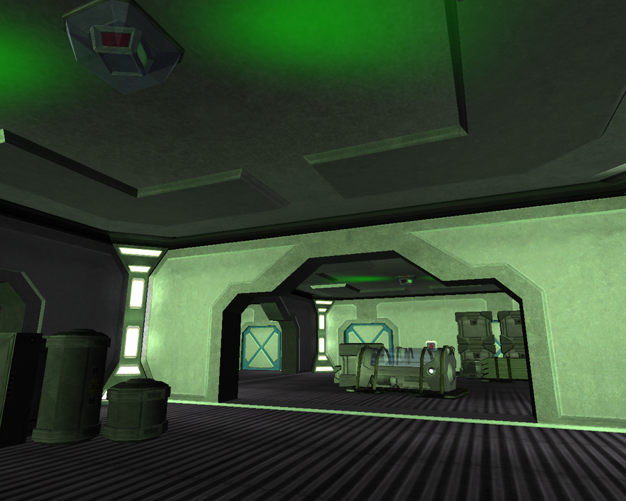

 has
been infected with a virus\]\]

A Virus is a corrupted data stream injected into base objects and
deployables by the [T-REK](T-REK "wikilink"). A Virus can be removed
from an object by an [expert hacker](Expert_Hacking "wikilink") using a
[REK](REK "wikilink").

The [T-REK](T-REK "wikilink") may be used to infect
[facility](facility "wikilink") systems by uploading a virus into the
[Main Terminal](Main_Terminal "wikilink"). The possible viruses for the
Main Terminal and duration are listed below.

- Unlock all base doors - **60 minutes**
- Disable enemy radar - **15 minutes**
  - Removes all radar abilities for friendlies that are in the
    [SOI](SOI "wikilink") of the infected facility
- Disable linked benefits - **15 minutes**
  - All [module](module "wikilink") benefits are disabled
  - [Continent](Continent "wikilink")/[Cavern](Cavern "wikilink")
    lock benefits will **not** be disabled
  - Will **not** effect other linked bases
- Access all enemy [equipment
  terminals](equipment_terminal "wikilink") - **2 minutes**
- Double [NTU](NTU "wikilink") resource drain - **60 minutes**
  - NTU will deplete at twice the normal rate

Viruses in the Main Terminal can be switched every 2 minutes or removed
by an expert hacker at any time. The enemy will be informed of the virus
30 seconds after it is uploaded, and will cause the facility lights to
flash green. The virus information will also be available by double
clicking on the facility on the [Continental
Map](Continental_Map "wikilink"), where it will show the type of virus
installed if your empire installed it, or "infected" otherwise. Viruses
cannot be installed into a base that is not powered. If the
[generator](generator "wikilink") is destroyed at a base with an active
virus, the virus is temporarily disabled. Viruses cannot be removed from
neutral bases (except by [Black Ops](Black_Ops "wikilink")).

Viruses can also be uploaded into enemy equipment, turning it against
their former owners for up to 15 minutes. The following equipment can be
infected so that it will hinder the enemy instead of helping them:

- Enemy [Spitfire Turrets](Spitfire_Turret "wikilink") and [Wall
  Turrets](Wall_Turret "wikilink") can be infected, causing them to
  attack their own Empire
- Enemy [Aegis Shield Generators](Aegis_Shield_Generator "wikilink")
  can be infected so that they emit a [Pain
  Field](Pain_Field "wikilink")
- Enemy [Motion Sensors](Motion_Sensor "wikilink") can be infected
  causing them to display friendly units as enemies on radar.

[Category:Terminology](Category:Terminology "wikilink")
