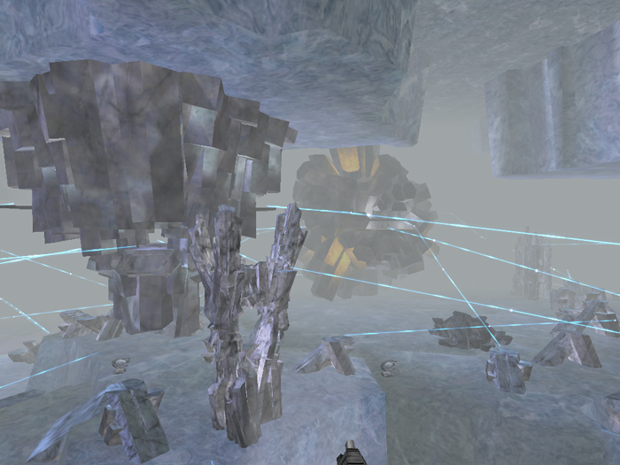

\]\]
 Adlivun is one of the six [Core
Combat](Core_Combat.md) [Caverns](Caverns.md).
Characterized by a large frozen lake and a large island in the middle,
Adlivun is a surprisingly difficult place for troops to navigate. With
long sight lines and little (or no) cover, the lake is a bad place for
troopers. Zip lines can be hard to navigate too, as they tend to head in
less than straight lines around the perimeter plateau. Even experienced
cave navigators have trouble getting around Adlivun. Vehicle access is
also difficult getting on and off the perimeter plateau, as ramps are
infrequent and are easily accessed by nearby bases.

Snipers tend to have a good time here, as the frozen lakebed affords
long sightlines and little cover. Vehicles dominate for the same reason,
though there is little room to hull down.

[Category:Locations](Category:Locations.md)
