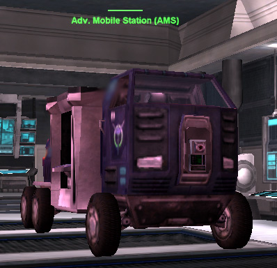

|                            |                                     |
| -------------------------- | ----------------------------------- |
| **Type**                   | Utility                             |
| **Role**                   | Mobile Spawn/Equipment Resource     |
| **Certification Required** | [Ground Support](Ground_Support.md) |
| **Empire**                 | [Common Pool](Common_Pool.md)       |
| **Primary Weapon**         | \-                                  |
| **Secondary Weapon**       | \-                                  |
| **Occupants**              | 1 (Driver)                          |
| **Handling**               | Very Poor                           |
| **Top speed**              | 68 kph                              |

**Advanced Mobile Station (AMS)**

The **Advanced Mobile Station (AMS)** provides a mobile [spawn
point](spawn_point.md), giving greater flexibility than the
fixed spawn points of [Towers](Towers.md) and
[Facilities](Facilities.md). Also adding to its benefits, it has
a five-second shorter spawn time than [Towers](Towers.md),
making them even more useful.

When deployed, it is surrounded by a cloaking "bubble" making it
impossible to see except when very close to it. Undeployed, it is very
visible, ponderous, and while well-armored, not apt to survive very long
in the field.

Early designs featured two [spawn tubes](Respawn_Tube.md) on
either side, but more recent designs allow soldiers to spawn anywhere
within the cloaking bubble. As of [2.7.6](2.md.7.6), the **AMS**
also features two [equipment terminals](equipment_terminal.md)
(on either side of the vehicle), a [matrix
terminal](Matrix_Panel.md) to [bind](bind.md) soldier's
DNA (at the front) and a [respawn panel](respawn_panel.md) (at
the rear).

Virtually no offensive assault—and many defensive stands—can be
successful without one or more well-placed **AMSes**.

[Category:Game Items](Category:Game_Items.md)
[Category:Vehicles](Category:Vehicles.md) [Category:Common Pool
Vehicles](Category:Common_Pool_Vehicles.md) [Category:Ground
Vehicles](Category:Ground_Vehicles.md)
