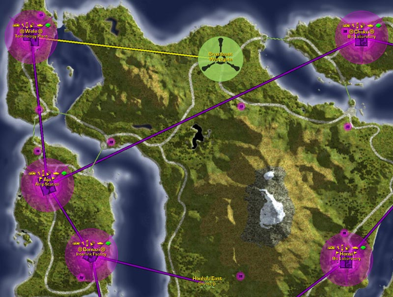

Located in western [Cyssor](Cyssor.md).

This facility is an [Amp Station](Amp_Station.md).

It currently has [Lattice](Lattice.md) Links to:

- [Wele](Wele.md)
- [Chuku](Chuku.md)
- [Bomazi](Bomazi.md)

Strategically important hold against invasions starting in
[Wele](Wele.md) by restricting bridge passage.

Aja is a [LLU](Lattice_Logic_Unit.md) [facility](facility.md).

- If Wele or Bomazi are unable to recieve an LLU, the LLU target of
  Chuku may be one of the longest in the game.

Elevation: 48.4m

[Category:Facilities](Category:Facilities.md)
