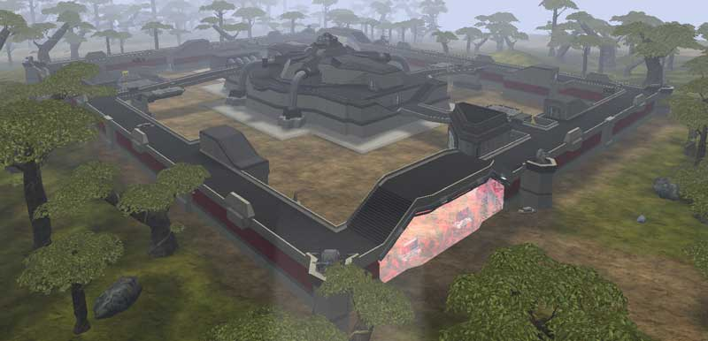

## Base Facility Specs

|                                                                |                                         |
| -------------------------------------------------------------- | --------------------------------------- |
| [Control Console](Control_Console "wikilink"):                 | Roof                                    |
| [Generator](Generator "wikilink"):                             | Basement                                |
| [Spawn room](Respawn_room "wikilink"):                         | Level 1                                 |
| [Vehicle Terminal](Vehicle_Terminal "wikilink") (Air/Ground):  | Courtyard                               |
| [BFR Shed](BFR_Shed "wikilink"):                               | Courtyard                               |
| [Lattice Logic Unit Socket](LLU "wikilink"):                   | Level 2                                 |
| [Facility Linked Benefit](Facility_Linked_Benefit "wikilink"): | Vehicle Shields (Benefit Icon: Vehicle) |
| [Wall Turrets](Phalanx "wikilink"):                            | 6                                       |
|                                                                |                                         |

## Description

[Amp Station](Amp_Station "wikilink")
[facilities](facilities "wikilink") are one of the most valuable
[facilities](facilities "wikilink"), and one of the easiest to take as
their [Control Console](Control_Console "wikilink") is located on the
roof of the facility and requires exterior travel for the defenders to
reach it.

Unique feature - [Control Console](Control_Console "wikilink") is on
roof

## Amp Station Locations

### [Amerish](Amerish "wikilink")

- [Verica](Verica "wikilink") (Capitol)
- [Sungrey](Sungrey "wikilink")

### [Ceryshen](Ceryshen "wikilink")

- [Akna](Akna "wikilink") (Sub-Capitol)

### [Cyssor](Cyssor "wikilink")

- [Aja](Aja "wikilink")
- [Ekera](Ekera "wikilink")
- [Kaang](Kaang "wikilink")
- [Nzame](Nzame "wikilink")
- [Pamba](Pamba "wikilink")

### [Esamir](Esamir "wikilink")

- [Freyr](Freyr "wikilink") (Sub-Capitol)
- [Kvasir](Kvasir "wikilink")
- [Nott](Nott "wikilink")

### [Forseral](Forseral "wikilink")

- [Eadon](Eadon "wikilink")
- [Pwyll](Pwyll "wikilink")

### [Hossin](Hossin "wikilink")

- [Ixtab](Ixtab "wikilink") (Sub-Capitol)

### [Ishundar](Ishundar "wikilink")

- [Enkidu](Enkidu "wikilink")

### [Oshur Battle Islands](Oshur "wikilink")

- [Mithra](Mithra "wikilink") (Extinction)
- [Sraosha](Sraosha "wikilink") (Ascension)

### [Searhus](Searhus "wikilink")

- [Matagi](Matagi "wikilink")
- [Pele](Pele "wikilink")
- [Rehua](Rehua "wikilink")

### [Solsar](Solsar "wikilink")

- [Mont](Mont "wikilink") (Sub-Capitol)
- [Bastet](Bastet "wikilink")

[Category:Locations](Category:Locations "wikilink")
