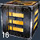

|                          |                                                                                   |
| ------------------------ | --------------------------------------------------------------------------------- |
| **Used by**              | [Mag-Scatter](Mag-Scatter.md), [Sweeper](Sweeper.md), [Jackhammer](Jackhammer.md) |
| **Empire**               | [Common Pool](Common_Pool.md)                                                     |
| **Inventory dimensions** | 3x3                                                                               |
| **Quantity per pack**    | 16 shells                                                                         |

**Armor Piercing (AP) Shotgun Shell**

Armor Piercing Shotgun Shells are, as the name indicates, the ammunition
used by Shotguns. A Shotgun Shell contains multiple small pellets that,
when fired, are fired at the target. Because these pellets spread out
after being fired, it is important to be as close to the target as
possible, as to minimize the amount of pellets missing their target. Due
to this, Shotguns are used primarily indoors and in other close combat
fights, as they are very ineffective at anything beyond close proximity.

The Armor Piercing Shotgun Shells do good damage to armored targets like
[MAX Units](Mechanized_Assault_Exo-Suit.md), [vehicles](vehicle.md) and
[Deployables](Adaptive_Construction_Engine.md), but are rather
ineffective against smaller, less armored targets. When encountering
such targets, it is best to use the standard [Shotgun
Shells](Shotgun_Shell.md).

Because Shotgun Shells are only used in small arms, they can penetrate
the shields of a [BattleFrame Robotic](BattleFrame_Robotics.md).

[Category:Game Items](Category:Game_Items.md)
[Category:Ammunition](Category:Ammunition.md)
