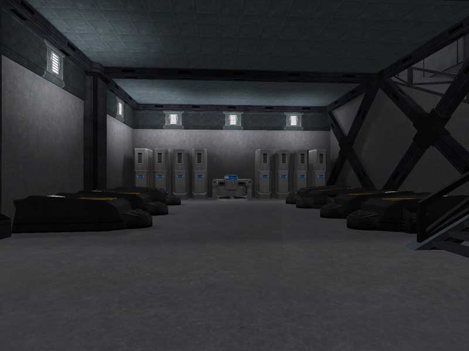

 barracks\]\]
This room is typically located one level beneath the
[lounge](Lounge.md) in all [facilities](Facilities.md)
(excluding [Bio Labs](Bio_Laboratory.md), which have a [Research
Room](Research_Room.md)).

The barracks contain two rows of [lockers](Lockers.md), a
[Medical Terminal](Medical_Terminal.md), and a row of cryo beds
for soldiers feeling under the weather.

A door at the bottom leads into the facility basement.

[Category:Locations](Category:Locations.md)
