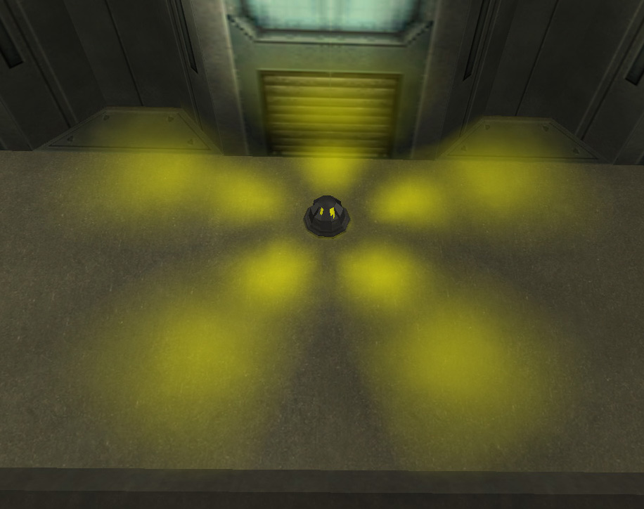

 Control Console\]\]
 Control Console\]\]
 Controle Console\]\] One control
console (CC) is located in each base and in each tower. Using a
[REK](Remote_Electronics_Kit.md), you can hack the console. The
time this takes depends on which level of the
[Hacking](<Hacking_(Certification)>) tree you are certed in.

- No Hacking [certification](certification.md): 60 seconds
- Hacking [certification](certification.md): 40 seconds
- [Advanced Hacking](Advanced_Hacking.md)
  [certification](certification.md): 20 seconds
- [Expert Hacking](Expert_Hacking.md)
  [certification](certification.md): 15 seconds

Once hacked, a tower immediately converts to the ownership of the
hacker's [empire](empire.md). For bases, there is a 15 minute
timer activated the moment the hack is activated. When the timer
expires, the hacker's empire gets control of the base except in the case
of an [LLU](Lattice_Logic_Unit.md) base. In those cases a 15 minute timer
limits how long the LLU is available to be run to the appropriate base.
If the LLU is not run in time than the hack will be cancelled. The CC
can be immediatly re-hacked however, to start the LLU timer over again.

Bases can only be hacked if they are linked via the
[lattice](lattice.md) to a friendly base, or if the base has
gone [neutral](neutral.md).

Hacking an enemy base will also disrupt their [Facility Linked
Benefits](Facility_Linked_Benefit.md).

 Warning Light: Control
Console Hacked\]\]

[Category:Locations](Category:Locations.md)
