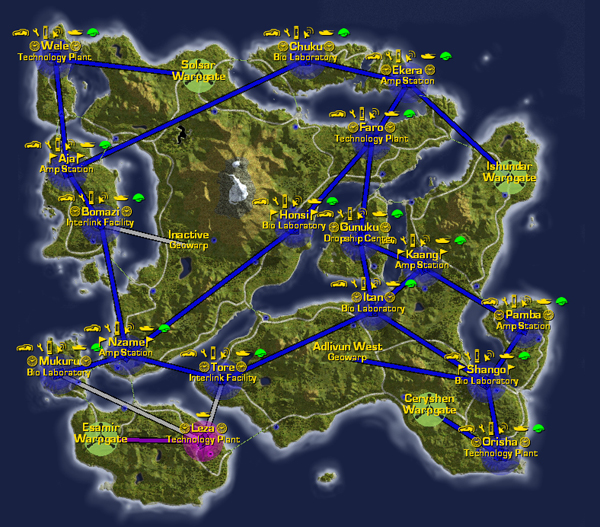

## Continental Data

|                                      |                                          |
| ------------------------------------ | ---------------------------------------- |
| Category:                            | Pre-Nova System                          |
| Climate:                             | Temperate, tropical                      |
| Landmass:                            | Continent                                |
| Terrain:                             | Rivers, hills, lakes, mountains, beaches |
| Facilities:                          | 17                                       |
| Towers:                              | 33                                       |
| Active Warpgates:                    | 3                                        |
| Active Geowarps:                     | 1                                        |
| [Empire Benefit](Empire_Benefit.md): | +10% armor bonus to vehicles             |
| Nickname:                            | The Devil's Pants                        |
|                                      |                                          |

## Description

The [planet](Planet.md) that Cyssor is on may not last more than
a few more decades. Its sun is unstable and is on the verge of tearing
itself apart, exploding outward and destroying its solar system. Already
the skies burn with the extra radiation and flares that beat against the
upper atmosphere.

The planet itself occationally tremors and shakes against the coming
storm, but is generally still stable. In ages past, these quakes shook
this continent until it broke and the pieces that remain look more like
islands than an intact continent.

Bridges span the many waterways on this island
[continent](Continent.md) and it still has the tallest mountain
on the planet. Commanders will recognize the many traffic flow
bottlenecks and the centrally located [Dropship
Center](Dropship_Center.md) in the middle of Cyssor.

[Continent Locking](Continent_lock.md) Cyssor grants a +10%
armor bonus to all vehicles of given empire.

---

--source: Planetside In-game descriptions, pre- and post-Bending.

## Base Facilities

### Amp Stations

- [Aja](Aja.md)
- [Ekera](Ekera.md)
- [Kaang](Kaang.md)
- [Nzame](Nzame.md)
- [Pamba](Pamba.md)

### Bio Laboratories

- [Honsi](Honsi.md)
- [Chuku](Chuku.md)
- [Itan](Itan.md)
- [Mukuru](Mukuru.md)
- [Shango](Shango.md)

### Dropship Center

- [Gunuku](Gunuku.md)

### Interlink Facilities

- [Tore](Tore.md)
- [Bomazi](Bomazi.md)

### Technology Plant

- [Faro](Faro.md)
- [Leza](Leza.md)
- [Orisha](Orisha.md)
- [Wele](Wele.md)

[Category:Locations](Category:Locations.md)
