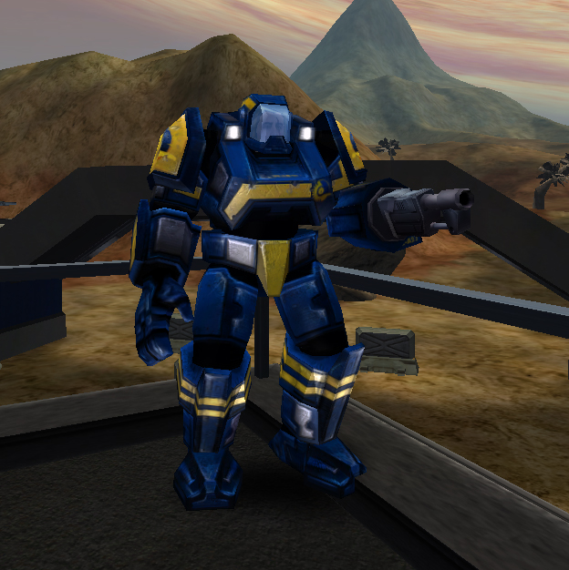

s Anti-Vehicular
[MAX](MAX.md)\]\]

|                            |                                                                                                                      |
| -------------------------- | -------------------------------------------------------------------------------------------------------------------- |
| **Certification Required** | [Anti-Vehicle MAX](<Anti-Vehicle_MAX_(Certification)>) or [Uni-MAX](<Uni-MAX_(Certification)>) |
| **Empire**                 | [New Conglomerate](New_Conglomerate.md)                                                                   |
| **Armor**                  | 650                                                                                                                  |
| **Primary Mode**           | Normal fire                                                                                                          |
| **Secondary Mode**         | \-                                                                                                                   |
| **Magazine Capacity**      | 20                                                                                                                   |
| **Ammunition**             | Missiles                                                                                                             |
| **Special Ability**        | Shield                                                                                                               |

**Falcon**

The [New Conglomerate](New_Conglomerate.md)'s [Anti-Vehicle
MAX](<Anti-Vehicle_MAX_(Certification)>) is armed with a
powerful rocket launcher. Although the **Falcon** is dumb-fire mode
only, its quick rate of fire and strong ammunition make it a formidable
opponent.

Shots to kill:

|                                                          |          |
| -------------------------------------------------------- | -------- |
| [Standard Exo-Suit](Standard_Exo-Suit.md)     | 5 shots  |
| [Agile Exo-Suit](Agile_Exo-Suit.md)           | 6 shots  |
| [Reinforced Exo-Suit](Reinforced_Exo-Suit.md) | 9 shots  |
| [MAX](MAX.md)                                 | 10 shots |

(The above numbers are taken with 100 Health and full Armor; no
[MedKits](MedKit.md), [Implants](Implants.md) or [Empire
Incentives](Empire_Incentives.md) applied)

[Category:Game Items](Category:Game_Items.md)
