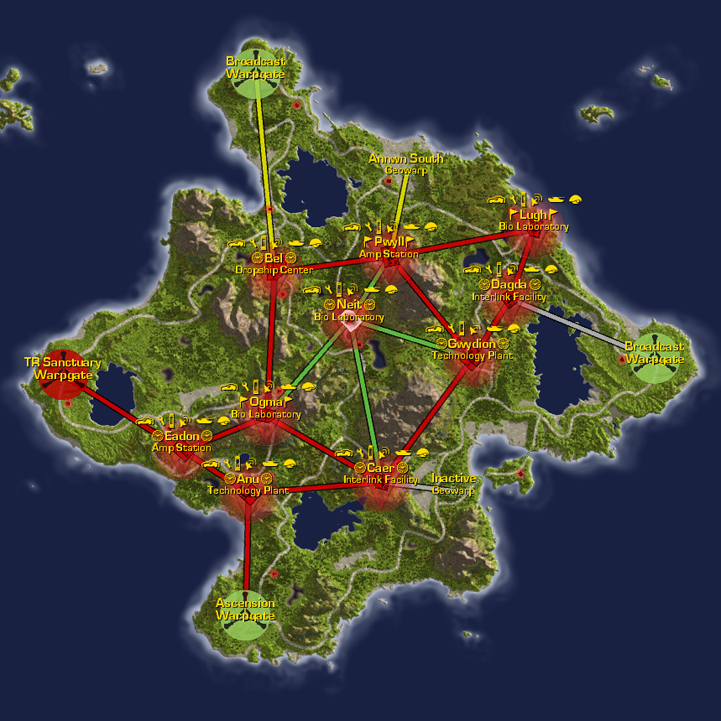

## Continental Data

|                                             |                                                                           |
| ------------------------------------------- | ------------------------------------------------------------------------- |
| Category:                                   | Binary Temperate                                                          |
| Climate:                                    | Temperate                                                                 |
| Landmass:                                   | Continent                                                                 |
| Terrain:                                    | Grassy plains, woodlands, lakes, rocky peaks, wide beaches                |
| [Facilities](Facilities.md "wikilink"):     | 10                                                                        |
| [Towers](Tower.md "wikilink"):              |                                                                           |
| Active [Warpgates](Warpgate.md "wikilink"): | 4                                                                         |
| [Capitol](Capitol.md "wikilink"):           | [Bio Laboratory](Bio_Laboratory.md "wikilink") [Neit](Neit.md "wikilink") |

## Description

Forseral's planet sits in a nice habitable band of a binary star system.
This lush, idyllic setting is often marred by the raging warfare
criss-crossing its surface.

This sprawling continent is temperate in nature. Lakes dot the map, and
peaks jut up into the sky. Pockets of trees provide visual screening for
ground troops, while ridges of mountains prevent straight-line travel
from area-to-area.

This is a home continent with a [Sanctuary](Sanctuary.md "wikilink") link
to the technology plant of [Eadon](Eadon.md "wikilink"). See [Home
Continent](Home_Continent.md "wikilink") for the current empire sanctuary
links.

This continent is also refered to as
[Fors](Acronyms_and_Slang.md "wikilink").

---

--source: Planetside In-game descriptions, pre- and
post-[Bending](Bending.md "wikilink").

## Base [Facilities](Facilities.md "wikilink")

### [Amp Stations](Amp_Station.md "wikilink")

- [Eadon](Eadon.md "wikilink")
- [Pwyll](Pwyll.md "wikilink") ([Sub-Capitol](Sub-Capitol.md "wikilink"))

### [Bio Laboratories](Bio_Laboratory.md "wikilink")

- [Lugh](Lugh.md "wikilink")
- [Neit](Neit.md "wikilink") ([Capitol](Capitol.md "wikilink"))
- [Ogma](Ogma.md "wikilink") (Sub-Capitol)

### [Dropship Centers](Dropship_Center.md "wikilink")

- [Bel](Bel.md "wikilink")

### [Interlink Facilities](Interlink_Facilities.md "wikilink")

- [Caer](Caer.md "wikilink") (Sub-Capitol)
- [Dagda](Dagda.md "wikilink")

### [Technology Plants](Technology_Plant.md "wikilink")

- [Anu](Anu.md "wikilink")
- [Gwydion](Gwydion.md "wikilink") (Sub-Capitol)

[Category:Locations](Category:Locations.md "wikilink")
