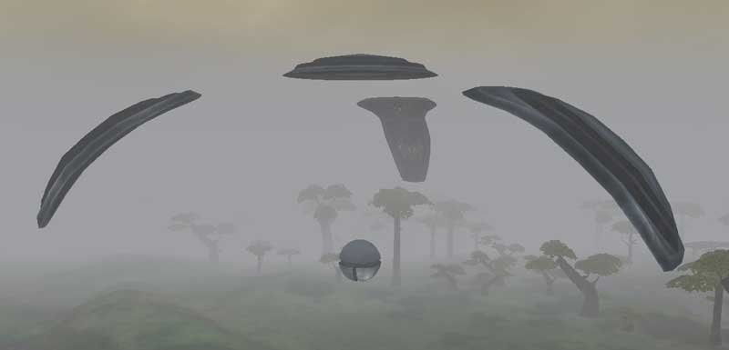
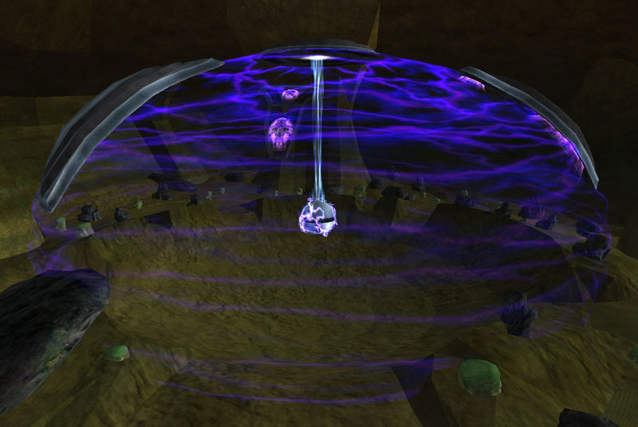

 [Cavern](Cavern "wikilink")\]\]
Geowarps are similar to [warpgate](warpgate "wikilink")'s ability to
transport you from planet to planet, but geowarps teleport you to the
[Caverns](Caverns "wikilink"). A player may
[broadcast](broadcast "wikilink") to these gates just as they can a
warpgate. Teleporting directly into the caves from a warpgate is not
possible, however. When broadcasting from a warpgate to a geowarp you
must first exit the warp bubble, then re-enter it and travel through the
central beam to teleport to the linked cavern.

Every planet possesses two [Geowarps](Geowarp "wikilink") (except for
the [Oshur](Oshur "wikilink") [Battle
Islands](Battle_Islands "wikilink"), which only contain one
[Geowarp](Geowarp "wikilink") located on [Nexus](Nexus "wikilink"), but
it is presently always inactive), and two [caverns](caverns "wikilink")
are open at any time, meaning that 11 [geowarps](geowarp "wikilink")
will be inactive at any given time (2 caverns x 4 geowarps per cavern -
9 planets x 2 [geowarps](geowarp "wikilink") per planet + 1 geowarp on
[Nexus](Nexus "wikilink") = 11 inactive [geowarps](geowarp "wikilink")).

However, the programming intentionally makes it so that all the
"[Neutral](Neutral_Continent "wikilink")" continents are always linked
to a cave by a geowarp, even when the caves rotate. This means that one
[Home Continent](Home_Continent "wikilink") of one
[empire](empire "wikilink") will not have an active cavern link at any
give time.

Geowarps are the means by which [Cavern Locks](Cavern_Lock "wikilink")
link to facilities to provide [Module
benefits](Module_benefit "wikilink").

[Category:Locations](Category:Locations "wikilink")
