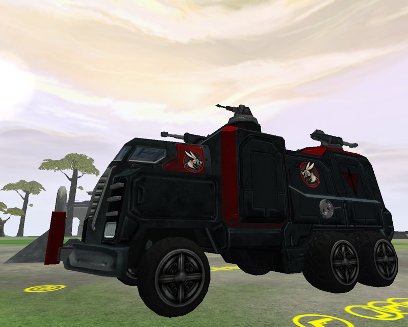

 Juggernaut\]\]

|                            |                                                                                                                                                                                      |
| -------------------------- | ------------------------------------------------------------------------------------------------------------------------------------------------------------------------------------ |
| **Type**                   | Heavy Transport                                                                                                                                                                      |
| **Role**                   | Heavy Troop Transport                                                                                                                                                                |
| **Certification Required** | [Ground Transport](Ground_Transport.md "wikilink")                                                                                                                                   |
| **Empire**                 | [Terran Republic](Terran_Republic.md "wikilink")                                                                                                                                     |
| **Primary Weapons**        | 2 75mm Tank Cannons, 2 15mm Chainguns, 2 side [Ballguns](Ballgun.md "wikilink")                                                                                                      |
| **Secondary Weapon**       | \-                                                                                                                                                                                   |
| **Ammunition Used**        | [Lightning Shell](Lightning_Shell.md "wikilink"), [15mm Chaingun Bullets](15mm_Chaingun_Bullets.md "wikilink"), and [Rotary Chaingun Bullets](Rotary_Chaingun_Bullets.md "wikilink") |
| **Occupants**              | 11 (Driver, 6 Gunners, 2 Infantry Passengers and 2 [MAX](MAX.md "wikilink") Passengers)                                                                                              |
| **Handling**               | Poor                                                                                                                                                                                 |
| **Top speed**              | 58 kph                                                                                                                                                                               |
| **Special Features**       | Driver [EMP](EMP.md "wikilink") weapon, can pass through [Shield Module](Shield_Module.md "wikilink") defenses.                                                                      |

**Juggernaut**

The _Juggernaut_ is the Terran Republic's heavy troop transport vehicle.
It features 2 75mm and 2 15mm Chainguns on the top and 2
[Ballguns](Ballgun.md "wikilink") on the side. The Juggernaut can pass
through enemy [Shield Module](Shield_Module.md "wikilink") defenses.

The 15mm Chainguns are nearly identical to those found on the
[Raider](Raider.md "wikilink") and [Prowler](Prowler.md "wikilink"). These are
best used to combat enemy aircraft and vehicles, not infantry.

The driver can wear up to [Reinforced
Exo-Suit](Reinforced_Exo.$1.md "wikilink") armor. The driver also has
access to an [EMP](EMP.md "wikilink") blast (default key: "b"). The
capacitor must recharge before it can be fired again. The capacitor
status is shown on the [HUD](HUD.md "wikilink") bar. The driver can also
activate the vehicle horn (default key: "f").

The side [Ballguns](Ballgun.md "wikilink") have a limited view, but if the
user has the [Darklight](Darklight.md "wikilink")
[Implant](Implant.md "wikilink"), he/she can see
[cloaked](Infiltration_Suit.md "wikilink") enemies at a longer range than
normal, providing excellent side defense.

Originally, the name "Juggernaut" was given to the Terran Republic's
gunner variant [BFR](BFR.md "wikilink"), which is now known as the
[Colossus](Colossus.md "wikilink").

[category:Terran Republic
Vehicles](category:Terran_Republic_Vehicles.md "wikilink")

[Category:Game Items](Category:Game_Items.md "wikilink")
[Category:Vehicles](Category:Vehicles.md "wikilink") [Category:Ground
Vehicles](Category:Ground_Vehicles.md "wikilink")
