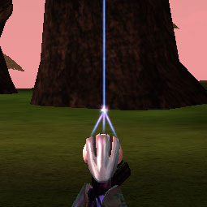

|                            |                                          |
| -------------------------- | ---------------------------------------- |
| **Certification Required** | None                                     |
| **Empire**                 | [Common Pool](Common_Pool.md) |
| **Primary Mode**           | Paint Target                             |
| **Secondary Mode**         | \-                                       |
| **Ammunition**             | \-                                       |
| **Inventory Dimensions**   | 3 x 3 (Pistol Holster)                   |
| **Magazine Capacity**      | \-                                       |
| **Zoom**                   | None                                     |

**Laze Pointer**

[image:Laze-Icon.jpg](image:Laze-Icon.md.jpg)

The [Laze Pointer](Laze_Pointer.md) allows front-line troops to
indicate targets for [Flail](Flail.md) gunners, who will be
quite far from the target. (It is also useful for
[Liberator](Liberator.md) bombing runs.)

The Laze Pointer can be obtained from any [Equipment
Terminal](Equipment_Terminal.md) or directly from a deployed
[Flail](Flail.md).

Simply point the [Laze Pointer](Laze_Pointer.md) at the target
and hold the trigger. A progress bar indicates the time to completion.
Once completed, a temporary targeting waypoint will be visible in the
[HUD](HUD.md) and on the [Proximity
Map](Proximity_Map.md) for members of the Platoon. Unlike normal
[waypoints](waypoint.md), targeting waypoints are circular on
the proximity map, use the color and number of the user, and go away
after about 15 seconds.

[Category:Game Items](Category:Game_Items.md)
[Category:Weapons](Category:Weapons.md) [Category:Common Pool
Weapons](Category:Common_Pool_Weapons.md)
