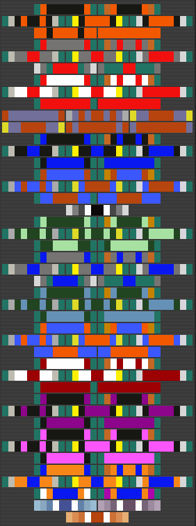
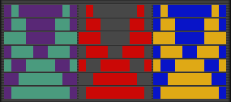

# Introduction to Merit Commendations

Merit Commendations are awards for certain activities done within the
game. This includes:

- Kills using certain [weapons](Weapon.md) or
  [vehicles](Vehicle.md)
- Destroying a specific kind of unit
- Kills under certain circumstances
- Supporting/Assisting other players
- Visiting certain locations
- Attending events
- [Jacking](Jack.md) vehicles

Merits are displayed in the player pane under the "Achievements" tab.
This window shows both the Merits you are displaying, and the Merits you
have earned. It also tells the date you earned that Merit.

The bottom of this window gives you an option to check the progress
towards other Merits, allowing you to see how close you are to that next
level. Simply clicking the "Award Progress" button will open it up.

At the top of the window is your "display case" which house three
Merits. This is where you can drop certain merits from the list to be
displayed to other soldiers on your avatar's shoulder pad, making for
easy bragging. Note that the [Annual Terms of
Service](Term_of_Service.md) Merits are different from all other
Merits. These are automatically added on your Shoulder Pad the moment
you get them, and you cannot remove it, change its position or drag it
into the Display Case. It will always display your highest Term of
Service Merit.

Below is a listing of all the Merit Commendations available in the game.
Clicking the title will take you to the Merits individual pages, which
list the requirements for each Merit and off course the graphic of the
Merit.

# Categories of Available Merit Commendations

At present, there are six categories of Merit Commendations:

<table border="0">
<tr>
<td width="190" align="center" valign="top">

<b></b>
\]\]

</td>
<td width="170" align="center" valign="top">

<b></b>
\]\] <b></b>
\]\]

</td>
<td width="190" align="center" valign="top">

<b></b>
\]\]

</td>
<td width="190" align="center" valign="top">

<b></b>
\]\]
<b></b>
\]\]

</td>
</tr>
</table>

# Obtaining Merit Commendations

## Unique Kills

In order for a kill to count towards a certain Merit Commendation it
must be a [Unique Kill](Unique_Kill.md).

## Merit Commendation Streaks

Some Merit Commendations require X amount of kills to qualify for that
merit, and then a streak to complete it.

Said streaks require you to kill a certain amount of people without
dying.

- Example:

The [Heavy Assault](<Heavy_Assault_(Merit)>) Platinum Merit
Commendation requires 8,000 kills to Qualify for it. After you have
achieved those 8,000 kills the game will flag you as Qualified and you
will have to kill 12 Enemy Soldiers ([Unique
Kills](Unique_Kill.md)) to obtain the Heavy Assault Platinum
Merit. You don't have to complete the streak in the same session,
however, you can work on it until you complete it. Streak kills are also
saved if you logout, meaning that if you have 8 kills for the Heavy
Assault Platinum streak, and you logout, you will still have those 8
kills when you start PlanetSide next time (provided you don't log on a
different character on that server or there is a game update/crash
between your sessions).

If you are working on a streak for a Merit, which requires 5 kills and
you die after getting 4 Streak kills, those 4 kills will count towards
the next level of the Merit that you are working on.

- Example:

You are working on [Basic Weapons](<Basic_Weapons_(Merit)>)
Silver streak, which requires 4 kills and it takes you 50 kills until
you finally get 4 in one life, then you will only have to get 50 kills
to qualify for Basic Weapons Gold, instead of 100.

## Kill Assists

Kill Assists are kills that a Friendly Soldier made after you Supported
him. You can Support someone and gain Kill Assists and Support
Experience Points through one of the following activities:

- Healing another Soldier
- Repairing another Soldier or [Vehicle](Vehicle.md) with
  either a [Nano Dispenser](Nano_Dispenser.md),
  [BANK](Body_Armor_Nano_Kit.md) or [Lodestar](Lodestar.md)
- [Reviving](Revive.md) another Soldier
- Hacking a Terminal or [Locker](Lockers.md) or providing an
  [AMS](Advanced_Mobile_Station.md) Terminal or Lodestar for others to obtain
  Equipment and/or Ammunition from.
- Providing an [Advanced Mobile
  Station](Advanced_Mobile_Station.md) for others to Spawn
  from.
- Having Soldiers bail from your [Galaxy](Galaxy.md)
- Placing or owning a [Router](Router.md)

Also see:

- [Assist](Assist.md) (For more Details about Kill Assists)
- [Support Merit
  Commendations](Support_Merit_Commendations.md) (For more
  Details about how to obtain the Support Merits and their
  requirments)

[category:Merits](category:Merits.md)
