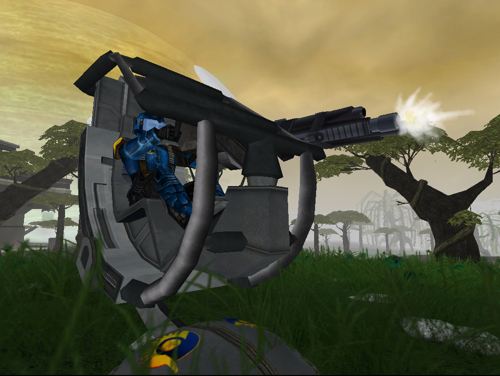
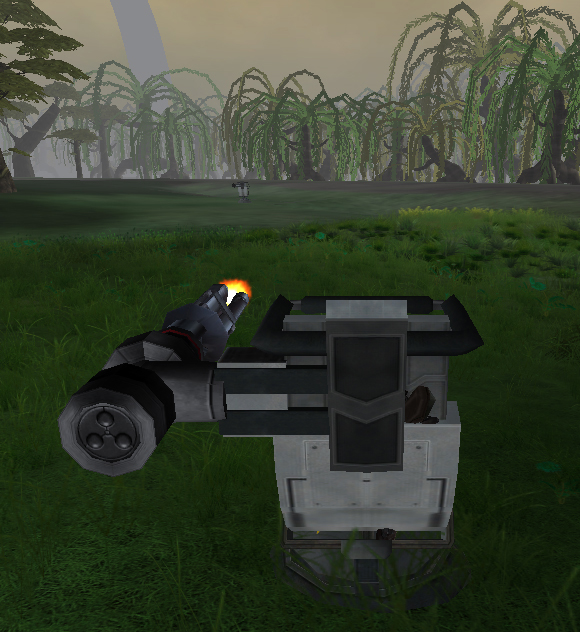

 Deployable Turret\]\]
 Deployable Turret\]\]
 Deployable Turret\]\]

|                            |                                               |
| -------------------------- | --------------------------------------------- |
| **Certification Required** | [Assault Engineering](Assault_Engineering.md) |
| **Empire**                 | [New Conglomerate](New_Conglomerate.md)       |
| **Primary Mode**           | Long-range ScatterCannon                      |
| **Secondary Mode**         | \-                                            |
| **Ammunition**             | \-                                            |
| **Inventory Dimensions**   | 3 x 9 (Rifle holster)                         |
| **Magazine Capacity**      | 35                                            |
| **Range**                  | 150 m                                         |
| **Zoom**                   | 4x                                            |

**Osprey**

The [New Conglomerate](New_Conglomerate.md) Variant of the
[One-Manned Field Turrets](One-Manned_Field_Turret.md), and is
deployed by use of the [Field Deployment
Unit](Field_Deployment_Unit.md). It is an adaptation of the
[Scattercannon](Scattercannon.md) [MAX](Mechanized_Assault_Exo-Suit.md) weapon,
though lacking the selectable spread. The [cone of
fire](cone_of_fire.md) is also significantly tighter than the
[MAX](Mechanized_Assault_Exo-Suit.md) counterpart, allowing for hitting enemies at
further distances.

[Category:Weapons](Category:Weapons.md)
