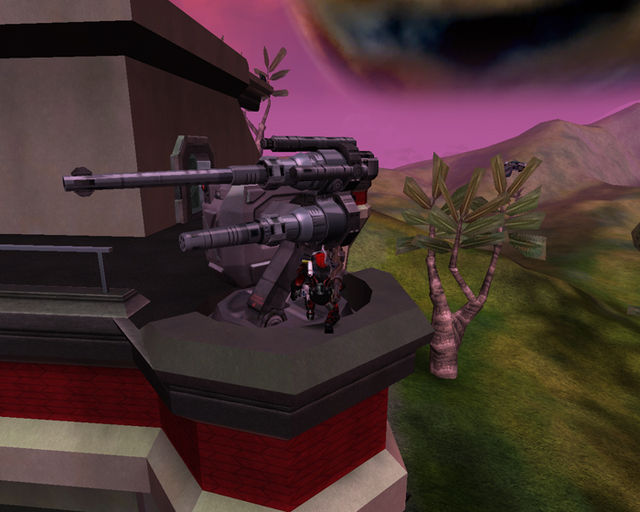

\]\]

 **Phalanx wall turrets** are the
only fixed weapons and non-passive defensive installations of [surface
bases](Facilities#Surface_Bases "wikilink") and gun and air
[towers](towers "wikilink").

When unmanned, the **Phalanx** can track and fire upon larger
[vehicles](Vehicle "wikilink") and aircraft, as well as
[MAX](Mechanized_Armored_Exo-Suit "wikilink") units (only if they are in
run mode). [ATVs](<ATV_(Certification)> "wikilink"),
[Harassers](Harasser "wikilink"), and [Mosquitos](Mosquito "wikilink")
are invisible to **Phalanx** turrets. An active unmanned **Phalanx**
will return fire if fired upon and is less than 50% damaged. It is
extremely accurate when unmanned, but its rate of fire is about
one-third of it is when manned.

When manned, the **Phalanx** offers a very high rate of fire, unlimited
ammunition, 360° rotation, a range of 400m, and a fairly high firing
angle which allows it to target aircraft. Unfortunately, it has a large
[cone of fire](Cone_of_fire "wikilink"), making it inaccurate at long
ranges. It can also be destroyed easily, taking only a few tank rounds
to make it inoperable.

When a **Phalanx** turret is completely destroyed, it becomes unusable.
It can be returned to working order again by repairing it to 50% of its
health using a [Nano Dispenser](Nano_Dispenser "wikilink"). The
**Phalanx** will be automatically repaired, albeit very slowly, as long
as the base has a supply of NTUs. Without any assistance from soldiers,
a completely destroyed **Phalanx** takes approximately 50 minutes to
self-repair to a usable state (therefore, an unattended **Phalanx** will
completely repair itself in about 1 hour and 40 minutes).

The **Phalanx** can be upgraded by soldiers having the [Fortification
Engineering](Fortification_Engineering "wikilink") certification to fire
either Anti-Aircraft or Anti-Armor rounds in addition to the standard
rounds. The Anti-Aircraft Flak Cannon rounds are similar to the
[flak](flak "wikilink") rounds of the [skyguard](skyguard "wikilink"),
but fires at a slightly slower rate. The Anti-Armor Twin-Cannons rounds
are similar to the rate of fire and trajectory of the
[prowler](prowler "wikilink") main gun, but the damage is not as great.
Kills made with the flak cannon also count towards the [Air
Defender](Air_Defender "wikilink") [merit](merit "wikilink"). Upgrades
are done with the [Nano Dispenser](Nano_Dispenser "wikilink") and last
for 30 minutes unless destroyed or the base changes
[empire](empire "wikilink") control. The type of upgrade can be changed
at any time by starting the process over again. When firing in auto-fire
mode, upgraded turrets only fire standard rounds.

Soldiers certed in [Data Corruption](Data_Corruption "wikilink") can
infect enemy Wall Turrets causing them to fire at their own Empire,
instead of their enemies. However, they will act as regular Wall Turrets
when infected, meaning they will only shoot
[vehicles](vehicle "wikilink") and auto-running [MAX](MAX "wikilink")
Units.

[Category:Game Items](Category:Game_Items "wikilink")
